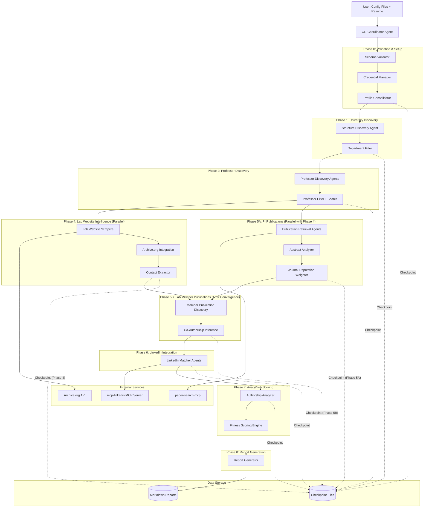
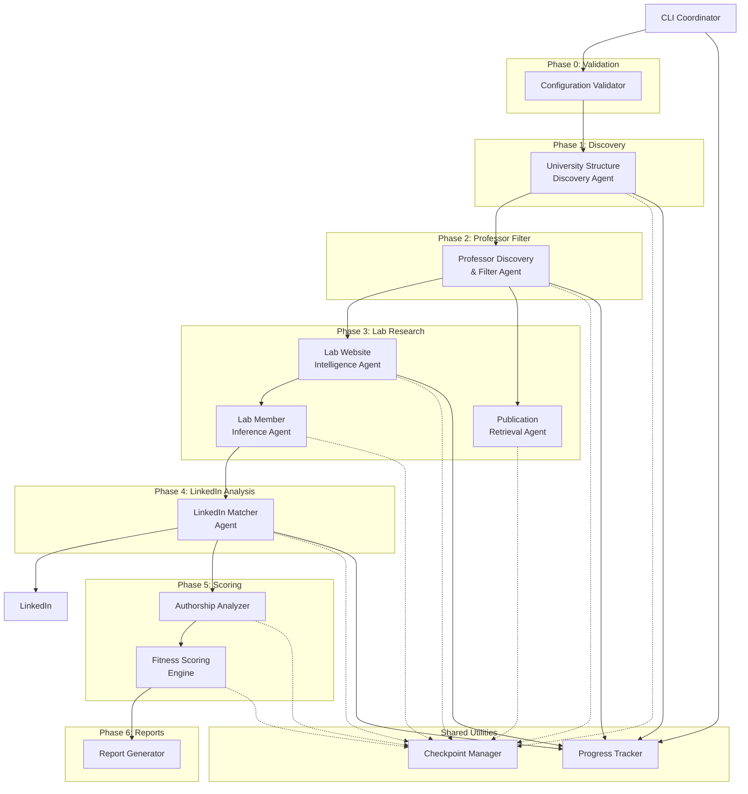
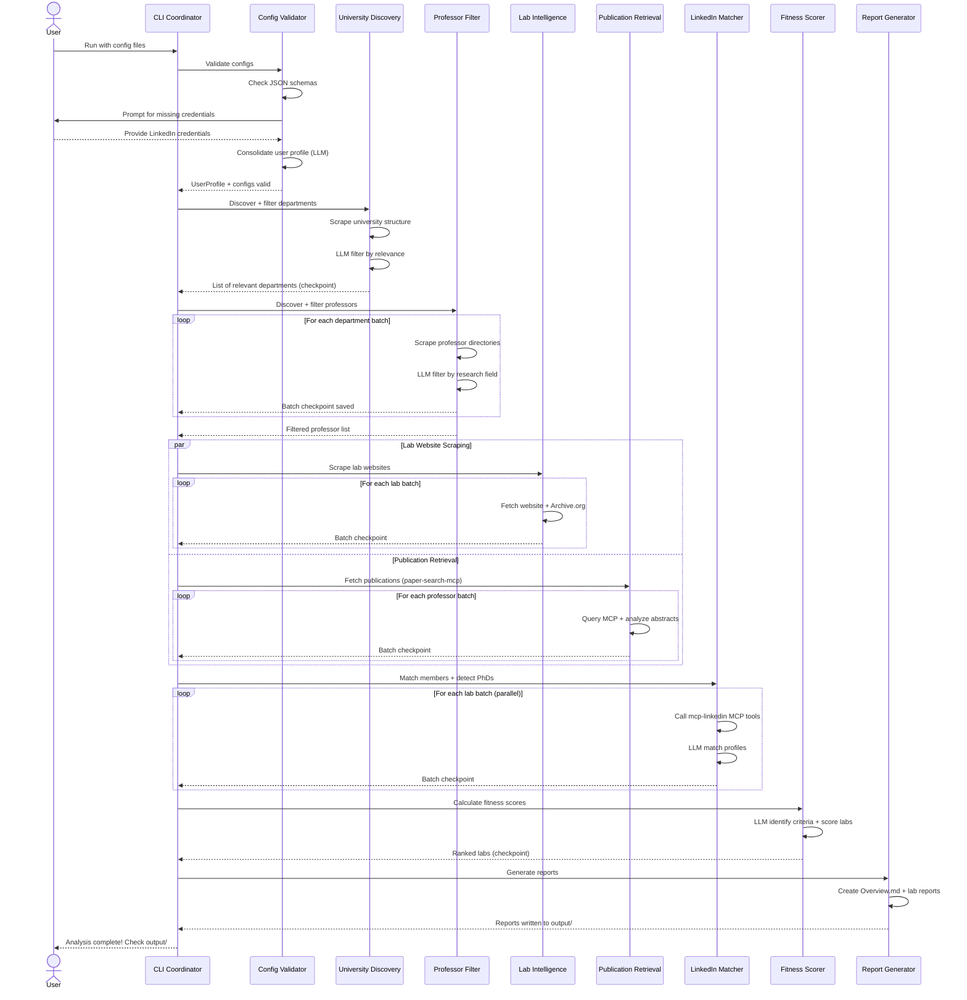
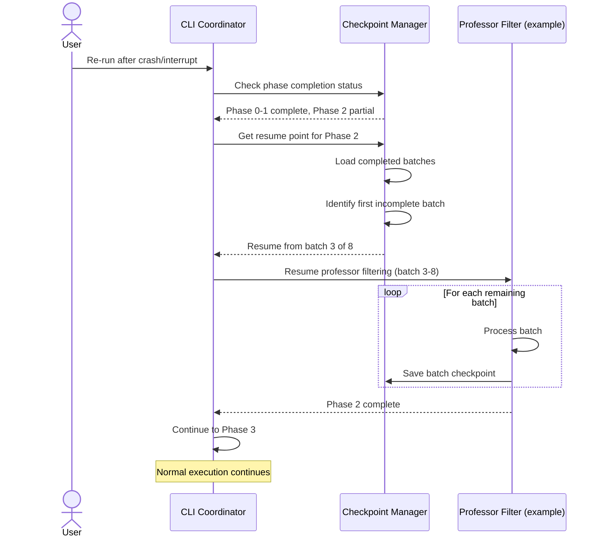
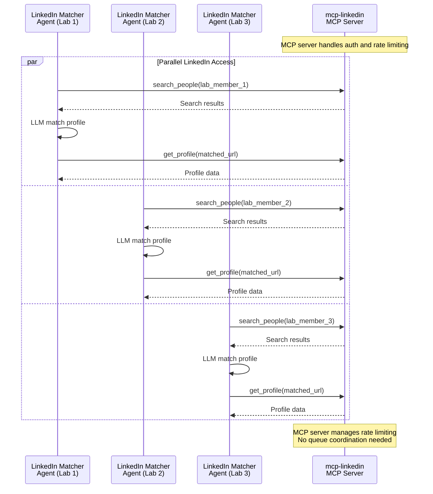
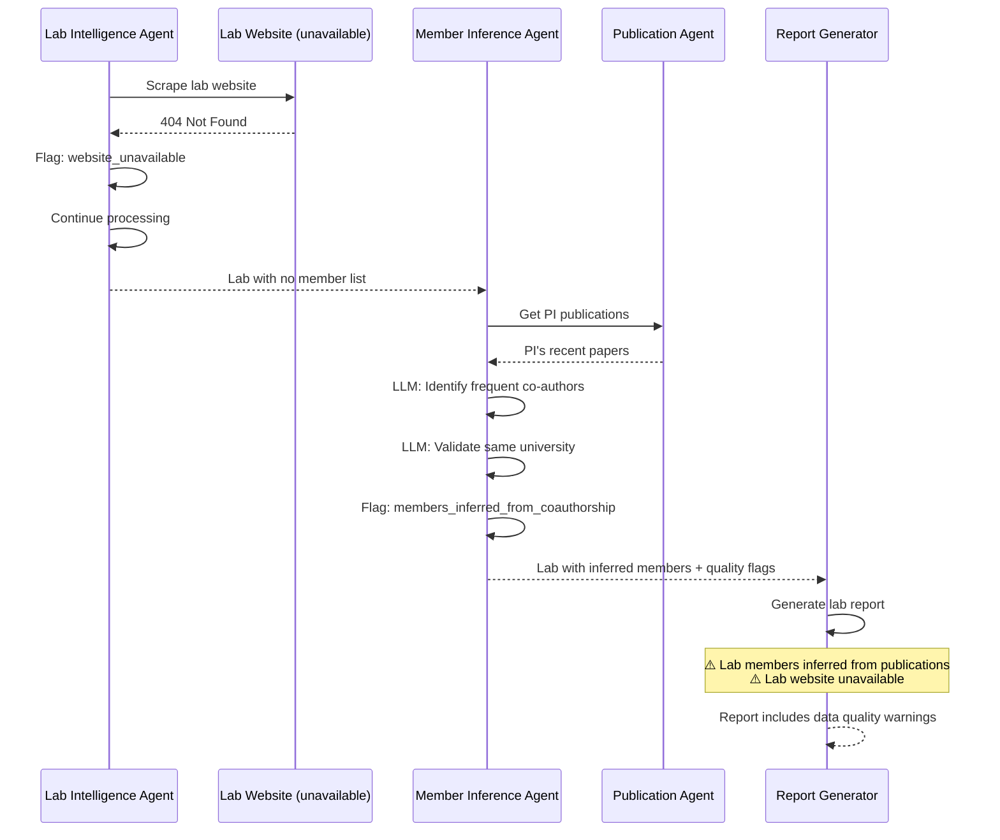

# Lab Finder Architecture Document

## Introduction

This document outlines the overall project architecture for Lab Finder, including backend systems, shared services, and non-UI specific concerns. Its primary goal is to serve as the guiding architectural blueprint for AI-driven development, ensuring consistency and adherence to chosen patterns and technologies.

**Relationship to Frontend Architecture:**
This is a CLI-only tool with no graphical user interface. All user interaction occurs through command-line prompts and markdown report outputs.

### Starter Template or Existing Project

**Decision:** Build from scratch without a starter template.

**Rationale:** This is a greenfield Python project built on the Claude Agent SDK. No standard starter templates match the specific multi-agent orchestration architecture required. The Claude Agent SDK provides the core framework, and we'll structure the project to precisely fit the multi-agent orchestration needs.

### Change Log

| Date | Version | Description | Author |
|------|---------|-------------|--------|
| 2025-10-06 | 0.1 | Initial architecture draft | Winston (architect) |
| 2025-10-06 | 0.2 | SDK validation updates: Added AgentDefinition implementations, web scraping decision tree, implementation patterns, and risk assessment | Winston (architect) |
| 2025-10-06 | 0.3 | Parallel execution optimization: Split Epic 5 into 5A/5B for concurrent execution with Epic 4, added convergence validation pattern, updated mermaid diagram | Sarah (PO) |

## High Level Architecture

### Technical Summary

Lab Finder is a **monolithic multi-agent Python application** orchestrated by the Claude Agent SDK. The system follows a **phased pipeline architecture** with checkpoint-based resumability, where each phase produces intermediate artifacts for the next.

The architecture centers on **hierarchical agent delegation**: a coordinator agent manages five sequential phases, delegating specialized sub-agents for parallel data collection (department discovery, professor analysis, publication retrieval, LinkedIn matching). Resource contention is managed through **queue-based coordination** for shared resources like the LinkedIn browser session.

Core technology choices include Python 3.11+ for async/await patterns, Playwright for browser automation, and MCP servers (paper-search-mcp) for publication data. The system emphasizes **graceful degradation** - missing data is flagged but doesn't block pipeline progression.

This architecture directly supports the PRD goals of systematic lab discovery with comprehensive intelligence gathering while managing complexity through phase isolation and configurable batch processing.

### High Level Overview

**Architectural Style:** Phased Pipeline with Multi-Agent Orchestration

**1. Main Architecture Pattern:**
- **Monolithic Application** (not microservices) - single Python process with multi-agent orchestration
- **Phased Pipeline** - 7 distinct phases (6 sequential + 1 parallel) with checkpoint-based resumability
- **Agent Delegation Model** - coordinator agent spawns specialized sub-agents per phase
- **Parallel Execution Optimization** - Phase 4 (Lab Websites) and Phase 5A (PI Publications) execute concurrently for 15-20% timeline reduction

**2. Repository Structure:**
- **Monorepo** (confirmed in PRD Technical Assumptions)
- Single Python project with clear module boundaries per phase

**3. Service Architecture:**
- **Single-process multi-agent system** (per PRD: "Monolithic Application with Multi-Agent Orchestration")
- Sub-agents execute in parallel within batch limits
- Shared resources (LinkedIn session) accessed via queue

**4. Primary Interaction Flow:**
```
User → CLI Input (config files) → Validation Phase →
University Discovery → Professor Filtering →
    ├─→ Lab Websites (Phase 4) ──┐
    └─→ PI Publications (Phase 5A) ─┘→ Convergence →
Lab Member Publications (Phase 5B) → LinkedIn Matching →
Authorship Analysis → Fitness Scoring → Report Generation →
Markdown Reports Output
```

**Note:** Phase 4 and Phase 5A execute in parallel to reduce overall timeline by 15-20%.

**5. Key Architectural Decisions:**

| Decision | Rationale |
|----------|-----------|
| **Phased pipeline vs. reactive event-driven** | Sequential phases with checkpointing enable resumability; clear progression tracking |
| **File-based persistence vs. database** | One-off execution doesn't justify database overhead; JSONL checkpoints sufficient |
| **Batch parallelism vs. unlimited concurrency** | Rate limiting compliance; prevents resource exhaustion; respects web scraping ethics |
| **Single shared Playwright session** | Minimizes LinkedIn ban risk; reduces authentication overhead |
| **Built-in web tools with Playwright fallback** | Leverages Claude Agent SDK capabilities; Playwright handles authentication edge cases |

### High Level Project Diagram



### Architectural and Design Patterns

**1. Multi-Agent Orchestration Pattern: Hierarchical Coordinator with Batch Delegation**

✅ **VALIDATED by Claude Agent SDK AgentDefinition**

**SDK Implementation:**
- Use `AgentDefinition` to create specialized agents per phase
- SDK handles parallel subagent execution automatically
- Coordinator manages phase progression via `ClaudeAgentOptions`
- Agents have isolated contexts (checkpoint-based state passing required)

**Options Considered:**
- **Option A:** Flat agent pool with work queue (all agents equal, pull tasks from queue)
- **Option B:** Hierarchical coordinator with phase-specific sub-agents (coordinator spawns specialized agents per phase)
- **Option C:** Event-driven reactive agents (agents respond to events, no central coordination)

**Recommendation:** **Option B - Hierarchical Coordinator**

**Rationale:**
- ✅ Direct SDK support via AgentDefinition
- ✅ Parallel execution built into SDK
- ✅ Clear phase progression tracking (user can see "Phase 2 of 6 complete")
- ✅ Checkpoint isolation aligns with agent context isolation
- ✅ Simplifies error handling (phase-level retry vs. per-agent recovery)
- ✅ Supports the PRD's explicit phased structure (Epics 1-8 map to phases)

---

**2. Data Persistence Pattern: Checkpoint/Restore with Batch-Level Granularity**

**Recommendation:** File-based JSONL checkpoints per batch within each phase

**Rationale:**
- Satisfies NFR12 (persist intermediate results for resumability)
- No database overhead for one-off execution tool (NFR9)
- JSONL format ideal for large lists (professors, publications) - append-only, stream-processable
- Batch-level checkpoints enable mid-phase restart: `checkpoints/phase-N-batch-M.jsonl`
- Resume logic: "Load completed batches, resume from first incomplete batch"
- Example: If 5 of 8 professor batches complete, restart from batch 6

---

**3. Concurrency Pattern: Bounded Parallel Batches with Hybrid Phase Execution**

**Recommendation:** Most phases execute sequentially; **Phase 4 and Phase 5A execute in parallel**; within each phase, sub-agents process in configurable batches

**Parallel Execution Model:**
- **Phase 4** (Lab Websites) and **Phase 5A** (PI Publications) run concurrently
- Both start after Phase 3 (Professor Filtering) completes
- **Convergence point** before Phase 5B: Both Phase 4 and 5A must complete
- Timeline reduction: **15-20%** compared to sequential execution

**Rationale:**
- Prevents overwhelming rate limits (NFR11, NFR4)
- Configurable batch sizes per phase (e.g., 5 departments, 20 professors, 10 labs)
- Playwright instance limits (NFR4: "limit concurrent Playwright instances")
- Clear progress indicators: "Processing batch 3 of 8 (professors 21-40)"

---

**4. Parallel Phase Convergence Pattern: Checkpoint-Based Validation**

**Recommendation:** Coordinator validates both Phase 4 and Phase 5A completion before starting Phase 5B

**Convergence Validation Logic:**
```python
async def validate_parallel_phase_completion(self):
    """Validate Epic 4 & 5A both complete before Epic 5B"""
    phase4_complete = self.checkpoint_mgr.phase_complete("phase-4-labs")
    phase5a_complete = self.checkpoint_mgr.phase_complete("phase-5a-pi-publications")

    if not phase4_complete:
        raise IncompletePhaseError("Phase 4 (Lab Websites) not complete")
    if not phase5a_complete:
        raise IncompletePhaseError("Phase 5A (PI Publications) not complete")

    logger.info("Convergence validated: Phase 4 & 5A complete, proceeding to Phase 5B")
    return True
```

**Progress Tracking During Parallel Execution:**
```python
# Display format during parallel phases
"Phase 4: Lab Websites [X/Y labs] | Phase 5A: PI Publications [A/B professors]"

# Display after convergence
"Convergence validated: Phase 4 & 5A complete → Starting Phase 5B (Member Publications)"
```

**Checkpoint Requirements:**
- Phase 4 checkpoint: `checkpoints/phase-4-labs-batch-*.jsonl`
- Phase 5A checkpoint: `checkpoints/phase-5a-pi-publications-batch-*.jsonl`
- Both must exist and be complete before Phase 5B can start

**Rationale:**
- Ensures data dependencies met (Phase 5B needs both lab member lists AND PI publications)
- Prevents premature Phase 5B execution if one parallel phase fails
- Clear user feedback about convergence point
- Enables resume from convergence if Phase 5B interrupted
- Story 5.4 and 5.5 explicitly depend on this convergence validation

---

**5. MCP-Based LinkedIn Access Pattern: Parallel MCP Server Integration**

**Recommendation:** Use mcp-linkedin MCP server for all LinkedIn operations; no queue needed

**Rationale:**
- MCP server handles authentication and session management internally
- Rate limiting managed by MCP server (no application-level queue required)
- Enables parallel LinkedIn profile matching (multiple agents can call MCP concurrently)
- Eliminates Playwright session complexity and ban risk management
- Simpler architecture: agents call MCP tools directly without coordination

---

**5. Error Handling Pattern: Graceful Degradation with Data Quality Flags**

**Recommendation:** Continue pipeline on failures; flag missing data in reports

**Rationale:**
- NFR13: "graceful degradation and clear error reporting"
- FR31-FR32: Infer missing data where possible; flag inferences
- Philosophy: Partial results better than no results
- Example: Missing lab website → infer members from co-authorship → flag as "inferred"

---

**6. Web Scraping Strategy: Tiered Fallback (Built-in → Playwright → Skip with Flag)**

**Recommendation:** Try Claude Agent SDK built-in tools first, fallback to Playwright, skip if both fail

**Rationale:**
- NFR5: "built-in web tools as primary, Playwright as fallback"
- Built-in tools faster and simpler for public pages
- Playwright needed for authenticated pages (LinkedIn) and JS-heavy sites
- Skip with data quality flag if both fail (don't crash pipeline)

---

**Decisions Finalized:**
- ✅ **Checkpoint format:** JSONL for efficient batch processing and streaming
- ✅ **Phase restart granularity:** Batch-level restart within phases
- ✅ **Batch sizes:** Default to 5 departments, 20 professors, 10 labs (configurable in system parameters)
- ✅ **LinkedIn Access:** Use mcp-linkedin MCP server (no Playwright queue needed)

## Tech Stack

This section defines the **DEFINITIVE technology selections** for the Lab Finder project. All implementation must adhere to these specific versions and tools.

### Cloud Infrastructure

**Provider:** Not applicable

**Rationale:** Local execution only (NFR9). No cloud deployment or managed services required.

**Storage:**
- **Local Filesystem** - All data persistence via local directories
- **Checkpoint Directory:** `./checkpoints/` - JSONL batch checkpoints
- **Output Directory:** `./output/` - Markdown reports and final deliverables
- **Configuration Directory:** `./config/` - JSON configuration files
- **Logs Directory:** `./logs/` - Structured JSON logs

### Technology Stack Table

| Category | Technology | Version | Purpose | Rationale |
|----------|-----------|---------|---------|-----------|
| **Language** | Python | 3.11.7 | Primary development language | Modern async/await, pattern matching, LTS release with performance improvements |
| **Framework** | Claude Agent SDK | latest | Multi-agent orchestration framework | Core framework per NFR1; provides agent delegation, tool integration |
| **Agent Definition** | AgentDefinition | SDK built-in | Custom agent configuration | Programmatic agent definition with prompts, tools, model selection |
| **Built-in Web Fetch** | WebFetch | built-in | Web page scraping | Primary web scraping; handles static HTML |
| **Built-in Web Search** | WebSearch | built-in | Web search | Augments discovery with targeted searches |
| **Browser Automation** | Playwright | 1.40.0 | Advanced web scraping | Required for JS-heavy sites, auth pages |
| **MCP Client** | mcp (Model Context Protocol) | 1.0.0 | MCP server communication | Connects to paper-search-mcp and mcp-linkedin servers (NFR6) |
| **HTTP Client** | httpx | 0.26.0 | Async HTTP requests | Archive.org API, web scraping fallback; native async support |
| **Archive.org Client** | waybackpy | 3.0.6 | Wayback Machine API wrapper | Website history snapshots (FR14); simplifies Archive.org CDX API interaction |
| **Schema Validation** | jsonschema | 4.21.1 | JSON configuration validation | Validates user configs against schemas (FR1); industry standard |
| **Configuration** | python-dotenv | 1.0.0 | Environment variable management | Credential loading; separates secrets from code (FR2-FR3) |
| **Logging** | structlog | 24.1.0 | Structured logging framework | Correlation IDs, agent context, JSON output for multi-agent tracing (NFR17) |
| **Progress Indicators** | rich | 13.7.0 | CLI progress bars and formatting | User-facing progress tracking (NFR14); markdown preview capabilities |
| **Testing Framework** | pytest | 7.4.4 | Test runner and framework | Industry standard; excellent async support, fixtures, parametrization |
| **Test Coverage** | pytest-cov | 4.1.0 | Code coverage reporting | Tracks test coverage metrics |
| **Async Testing** | pytest-asyncio | 0.23.3 | Async test support | Handles async/await test cases for agent orchestration |
| **Mocking** | pytest-mock | 3.12.0 | Test mocking and stubbing | Mocks external services (LinkedIn, Archive.org, paper-search-mcp) |
| **Linting** | ruff | 0.1.11 | Fast Python linter | Replaces flake8, black, isort; extremely fast, comprehensive rules |
| **Type Checking** | mypy | 1.8.0 | Static type analysis | Enforces type hints; catches type errors before runtime |
| **Data Validation** | pydantic | 2.5.3 | Runtime data validation | Type-safe configuration models; complements jsonschema |
| **Date/Time Utilities** | python-dateutil | 2.8.2 | Date parsing and manipulation | PhD graduation timeline calculations (FR21) |
| **Retry Logic** | tenacity | 8.2.3 | Configurable retry decorator | Web scraping error handling (NFR13); exponential backoff |
| **Rate Limiting** | aiolimiter | 1.1.0 | Async rate limiter | Per-source rate limiting (NFR11); prevents blocking |
| **CSV Processing** | pandas | 2.1.4 | Data manipulation for SJR database | Journal reputation data loading (FR17); CSV parsing |
| **JSONL Handling** | jsonlines | 4.0.0 | JSONL file read/write | Checkpoint file format; streaming support |
| **Environment** | virtualenv / venv | built-in | Virtual environment isolation | Dependency isolation; reproducible builds |
| **Package Management** | pip | 23.3+ | Dependency installation | Standard Python package manager |
| **Dependency Lock** | pip-tools | 7.3.0 | Requirements pinning | Generates requirements.txt from requirements.in; reproducible installs |

### Key Technology Decisions

**Python 3.11.7** (not 3.12+)
- Rationale: Balance of modern features and ecosystem stability; Claude Agent SDK compatibility confirmed

**jsonschema over pydantic for validation** (complementary use)
- Rationale: jsonschema for JSON file validation (FR1 explicitly requires JSON Schema); pydantic for runtime Python object validation

**httpx over requests**
- Rationale: Native async/await support; Claude Agent SDK likely uses async patterns; HTTP/2 support for faster concurrent requests

**structlog over logging/loguru**
- Rationale: Multi-agent context requires structured logging with correlation IDs; easier to track agent hierarchy in JSON logs

**rich over tqdm**
- Rationale: Single library for progress bars, formatted console output, and markdown rendering; better CLI aesthetics

**Scimago SJR CSV (static download)**
- Rationale: Free, comprehensive, no API limits; annual updates sufficient for one-off analysis

**ruff over black + flake8 + isort**
- Rationale: 10-100x faster; single tool replaces three; actively maintained by Astral (creators of uv)

**pytest ecosystem**
- Rationale: Standard for Python testing; excellent plugin ecosystem (asyncio, cov, mock); better DX than unittest

**mcp-linkedin over Playwright**
- Rationale: MCP server handles LinkedIn authentication and rate limiting; eliminates queue complexity; allows parallel LinkedIn access

**waybackpy for Archive.org**
- Rationale: Simplifies Wayback Machine CDX API interaction; handles snapshot queries and date parsing; complements httpx for Archive.org operations

---

**CRITICAL NOTES:**

⚠️ **Claude Agent SDK Version:** Listed as "latest" - version will be determined by official SDK release at implementation time. Pin specific version in requirements.txt after initial installation.

⚠️ **MCP Version:** Listed as "1.0.0" - verify actual version when configuring MCP servers (paper-search-mcp, mcp-linkedin).

⚠️ **MCP Servers Required:**
- `paper-search-mcp` - Publication retrieval
- `mcp-linkedin` (adhikasp-mcp-linkedin) - LinkedIn profile access

⚠️ **Version Pinning Strategy:** All versions listed are exact pins (not ranges). This ensures reproducible builds critical for one-off execution tool reliability.

⚠️ **Dependency Updates:** Do NOT update dependencies mid-implementation without architectural review. Version drift can break agent orchestration patterns.

---

### Web Scraping Tool Selection

**Decision Flow:**

1. **Public Static Page?**
   - YES → Use WebFetch
   - NO → Go to 2

2. **JavaScript-Heavy SPA?**
   - YES → Use Playwright via Bash
   - NO → Go to 3

3. **Authentication Required?**
   - YES → Use Playwright with session management
   - NO → Try WebFetch, fallback to Playwright

4. **WebFetch Failed?**
   - JS execution needed → Invoke Playwright
   - Rate limited → Retry with exponential backoff
   - Unreachable → Flag in data_quality_flags, continue pipeline

**Tool Usage Examples:**
- Static department directory → WebFetch ✓
- React-based professor listing → Playwright ✓
- LinkedIn profile (auth + dynamic) → Playwright ✓
- Archive.org snapshots → WebFetch ✓

## Data Models

These models represent the core domain entities flowing through the Lab Finder pipeline. All models are implemented as Pydantic classes with optional fields to support graceful degradation.

### User Profile

**Purpose:** Consolidated baseline for all matching and filtering operations (FR6)

**Key Attributes:**
- `name`: str - User's full name
- `current_degree`: str - Current degree program (e.g., "PhD in Computer Science")
- `target_university`: str - University being analyzed
- `target_department`: str - Primary department of interest
- `research_interests`: list[str] - Streamlined research interest statements
- `resume_highlights`: dict - Extracted resume sections (education, skills, research experience)
- `preferred_graduation_duration`: float - Average PhD duration for timeline calculations (FR5, default: 5.5)

**Relationships:**
- Used by Department Filter to identify relevant departments
- Used by Professor Filter to match research fields
- Used by Fitness Scorer to calculate alignment scores

---

### Department

**Purpose:** Represents university organizational structure (FR7-FR8)

**Key Attributes:**
- `id`: str - Unique identifier (generated)
- `name`: str - Department name
- `school`: Optional[str] - Parent school/college
- `division`: Optional[str] - Parent division
- `url`: str - Department homepage URL
- `hierarchy_level`: int - Depth in organizational tree (0=school, 1=division, 2=department)
- `is_relevant`: bool - Result of relevance filtering (FR9)
- `relevance_reasoning`: str - LLM explanation for filter decision

**Relationships:**
- One Department → Many Professors
- Departments form hierarchical tree structure

---

### Professor

**Purpose:** Faculty member with potential lab affiliation (FR10-FR13)

**Key Attributes:**
- `id`: str - Unique identifier (generated)
- `name`: str - Full name
- `title`: Optional[str] - Academic title
- `department_id`: str - Reference to Department
- `lab_name`: Optional[str] - Lab affiliation
- `lab_url`: Optional[str] - Lab website URL
- `email`: Optional[str] - Contact email (FR20)
- `research_areas`: list[str] - Research field descriptions from directory
- `is_filtered`: bool - Passed professor filter (FR11)
- `filter_confidence`: float - LLM confidence score 0-100 (FR12)
- `filter_reasoning`: str - Explanation for filter decision (FR13)

**Relationships:**
- Many Professors → One Department
- One Professor → One Lab (professor is the PI)
- One Professor → Many Publications

---

### Lab

**Purpose:** Research group with website, members, and publications (FR14-FR20)

**Key Attributes:**
- `id`: str - Unique identifier (generated)
- `pi_id`: str - Reference to Professor (principal investigator)
- `name`: str - Lab name
- `url`: Optional[str] - Lab website URL
- `description`: Optional[str] - Lab research focus from website
- `last_updated`: Optional[str] - Website last modification date (FR14)
- `wayback_history`: list[str] - Archive.org snapshot dates (FR14)
- `update_frequency`: Optional[str] - Website update pattern (monthly/yearly/stale)
- `contact_email`: Optional[str] - Lab contact email (FR20)
- `contact_form_url`: Optional[str] - Contact form URL (FR20)
- `application_url`: Optional[str] - Prospective student application URL (FR20)
- `members`: list[LabMember] - Current lab members (FR19)
- `members_inferred`: bool - Members inferred from co-authorship (FR31)
- `data_quality_flags`: list[str] - Missing data warnings (FR32)

**Relationships:**
- One Lab → One Professor (PI)
- One Lab → Many LabMembers
- One Lab → Many Publications (via PI and members)
- One Lab → Many Collaborations

---

### Lab Member

**Purpose:** Individual in research group (FR19, FR31)

**Key Attributes:**
- `id`: str - Unique identifier (generated)
- `lab_id`: str - Reference to Lab
- `name`: str - Full name
- `role`: Optional[str] - Position (PhD student, Postdoc, Research Scientist, etc.)
- `entry_year`: Optional[int] - Year joined lab
- `is_inferred`: bool - Inferred from co-authorship vs. listed on website (FR31)
- `inference_confidence`: Optional[float] - Confidence in inference 0-100
- `linkedin_profile_url`: Optional[str] - Matched LinkedIn profile (FR22)
- `linkedin_match_confidence`: Optional[float] - LLM match confidence 0-100 (FR22)
- `expected_graduation_year`: Optional[int] - Calculated from entry_year + duration (FR21)
- `is_graduating_soon`: bool - Within next year (FR21)
- `recently_departed`: bool - Graduated within last year (FR21)

**Relationships:**
- Many LabMembers → One Lab
- One LabMember → Many Publications (as co-author)
- One LabMember → One LinkedIn Profile (LLM-matched)

---

### Publication

**Purpose:** Research paper with authorship and journal metadata (FR15-FR17, FR30)

**Key Attributes:**
- `id`: str - Unique identifier (DOI or generated)
- `title`: str - Paper title
- `authors`: list[str] - Full author list in order
- `journal`: str - Journal or conference name
- `year`: int - Publication year
- `abstract`: Optional[str] - Paper abstract (FR30)
- `acknowledgments`: Optional[str] - Acknowledgment section (FR30)
- `doi`: Optional[str] - Digital Object Identifier
- `url`: Optional[str] - Paper URL
- `journal_sjr_score`: Optional[float] - Scimago Journal Rank score (FR17)
- `first_author`: str - First author name
- `last_author`: str - Last author name (often PI)
- `pi_author_position`: Optional[str] - PI's position in author list (first/last/middle)
- `relevance_score`: Optional[float] - LLM-assessed alignment with user interests
- `is_collaborative`: bool - External co-authors indicate collaboration (FR18)

**Relationships:**
- Many Publications → One Professor (as author)
- Many Publications → Many LabMembers (as co-authors)
- Many Publications → Many Collaborators (external)

---

### Collaboration

**Purpose:** Research partnership with external groups (FR18)

**Key Attributes:**
- `id`: str - Unique identifier (generated)
- `lab_id`: str - Reference to Lab
- `collaborator_name`: str - External researcher name
- `collaborator_institution`: str - External institution
- `frequency`: int - Number of co-authored papers
- `recent`: bool - Collaboration within last 3 years
- `papers`: list[str] - Publication IDs evidencing collaboration

**Relationships:**
- Many Collaborations → One Lab
- Many Collaborations → Many Publications

---

### Fitness Score

**Purpose:** Multi-factor lab ranking result (FR25)

**Key Attributes:**
- `lab_id`: str - Reference to Lab
- `overall_score`: float - Final fitness score 0-100
- `criteria_scores`: dict[str, float] - Score per criterion
- `criteria_weights`: dict[str, float] - Weight per criterion
- `scoring_rationale`: str - LLM explanation of score
- `key_highlights`: list[str] - Top factors influencing score
- `position_availability`: bool - Graduating PhD detected (FR21)
- `priority_recommendation`: int - Ranking tier (1=top priority, 2=strong candidate, 3=consider)

**Relationships:**
- One FitnessScore → One Lab
- Used to generate ranked Overview report (FR26)

---

### Data Model Design Principles

**1. LLM-Based Matching over Code Complexity:**
- **Name Matching:** Use LLM prompts to match professors/members across sources (directory, publications, LinkedIn) instead of algorithmic fuzzy matching
- **Profile Matching:** LLM evaluates candidate LinkedIn profiles considering name variations, affiliations, timelines (FR22)
- **Paper Deduplication:** LLM determines if papers with missing DOIs are duplicates based on title/authors/year
- **Rationale:** Claude Agent SDK provides LLM access; prompts handle edge cases (typos, name variants, institutional moves) better than code; dramatically reduces complexity

**2. Flexible Missing Data Handling:**
- All optional fields use `Optional[type]` in Pydantic models
- Validation checks for field presence but doesn't fail on missing data
- Missing fields tracked in `data_quality_flags` list for transparency in reports
- Processing continues with partial data; reports clearly indicate gaps with ⚠️ flags

**3. Denormalization for Pipeline Efficiency:**
- Some data duplicated (e.g., professor name in Publication authors and Professor entity) for query convenience
- JSONL files loaded into memory per phase; no complex joins needed
- Trade disk space for simpler code (acceptable for one-off tool)

**4. ID-Based References:**
- Entities reference each other via string IDs rather than embedded objects
- Supports JSONL streaming format (one JSON object per line)
- Python code resolves references by loading checkpoints and building lookup dictionaries

**Decisions Finalized:**
- ✅ Use LLM prompts for all fuzzy matching tasks (names, profiles, paper deduplication)
- ✅ All data models support optional fields with graceful degradation
- ✅ Track data quality issues in `data_quality_flags` per entity
- ✅ Implement models as Pydantic classes with type hints and validation

## Agent Definitions

This section provides the complete `AgentDefinition` implementations for all Lab Finder agents. Each agent is configured with a specific description, detailed prompt, tool restrictions, and model selection.

### Phase 0: Configuration Validator Agent

```python
config_validator = AgentDefinition(
    description="Validates JSON configurations and consolidates user profile",
    prompt="""Phase 0: Configuration Validation & Profile Consolidation

Your task: Validate all configuration files and create consolidated user profile

Steps:
1. Validate each config file against JSON schemas in src/schemas/
2. Load or prompt for LinkedIn credentials from .env
3. Use LLM to summarize resume into key highlights
4. Streamline research interests into clear statements
5. Save consolidated profile: checkpoints/phase-0-validation.json

Output format (JSON):
{
  "name": "...",
  "target_university": "...",
  "target_department": "...",
  "research_interests": [...],
  "resume_highlights": {...},
  "preferred_graduation_duration": 5.5
}
""",
    tools=["Read", "Write"],
    model="sonnet"
)
```

### Phase 1: University Structure Discovery Agent

```python
university_discovery = AgentDefinition(
    description="Discovers and filters university department structure",
    prompt="""Phase 1: University Structure Discovery

Your task: Discover and filter relevant departments

Steps:
1. Scrape university website for organizational structure
   - Try WebFetch first (fast for static pages)
   - If fails, use Bash to invoke Playwright script
2. Extract hierarchy: school → division → department
3. Filter departments by relevance to target_department
4. Save results to: checkpoints/phase-1-departments.jsonl

Output format (JSONL):
{"id": "dept-001", "name": "Computer Science", "school": "Engineering",
 "url": "...", "is_relevant": true, "relevance_reasoning": "..."}
""",
    tools=["WebFetch", "Bash", "Read", "Write", "Glob"],
    model="sonnet"
)
```

### Phase 2: Professor Discovery Agent

```python
professor_discovery = AgentDefinition(
    description="Discovers professors from department directories",
    prompt="""Phase 2A: Professor Discovery

Your task: Scrape professor directories from departments

Steps:
1. For each department from Phase 1 checkpoint:
   - Scrape professor directory page (WebFetch primary, Playwright fallback)
   - Extract: name, title, email, research areas, lab name/URL
2. Save batch results: checkpoints/phase-2-professors-batch-N.jsonl

Output format (JSONL):
{"id": "prof-001", "name": "Dr. Jane Smith", "department_id": "dept-001",
 "lab_name": "Vision Lab", "lab_url": "...", "research_areas": [...]}

Process in batches of 20 professors per checkpoint.
""",
    tools=["WebFetch", "Bash", "Read", "Write", "Glob"],
    model="sonnet"
)
```

### Phase 2: Professor Filter Agent

```python
professor_filter = AgentDefinition(
    description="Filters professors by research field alignment using LLM",
    prompt="""Phase 2B: Professor Filtering

Your task: Filter professors by research field match with user interests

Context: You receive user profile and professor list from checkpoints

Steps:
1. For each professor batch:
   - Compare research_areas against user research_interests
   - Provide confidence score (0-100)
   - Provide reasoning for inclusion/exclusion
2. Update professor records with filter results
3. Save filtered batch: checkpoints/phase-2-filtered-batch-N.jsonl

Output format (JSONL):
{"id": "prof-001", "is_filtered": false, "filter_confidence": 95.0,
 "filter_reasoning": "Strong alignment with CV and ML interests", ...}

Only pass professors with filter_confidence >= 75.
""",
    tools=["Read", "Write"],
    model="sonnet"
)
```

### Phase 3: Lab Scraper Agent

```python
lab_scraper = AgentDefinition(
    description="Scrapes lab websites and checks Archive.org history",
    prompt="""Phase 3A: Lab Website Intelligence

Your task: Scrape lab websites and analyze freshness

Steps:
1. For each filtered professor with lab_url:
   - Scrape lab website (WebFetch primary, Playwright fallback)
   - Extract: description, members, contact info
   - Check last-modified header
   - Query Archive.org API for snapshot history using httpx
2. Analyze update frequency: monthly/yearly/stale
3. Save results: checkpoints/phase-3-labs-batch-N.jsonl

Output format (JSONL):
{"id": "lab-001", "pi_id": "prof-001", "description": "...",
 "last_updated": "2024-09-15", "wayback_history": [...],
 "update_frequency": "monthly", "members": [...]}

Flag missing websites in data_quality_flags.
""",
    tools=["WebFetch", "Bash", "Read", "Write", "Glob"],
    model="sonnet"
)
```

### Phase 3: Publication Retrieval Agent

```python
publication_agent = AgentDefinition(
    description="Retrieves publications via paper-search-mcp and analyzes relevance",
    prompt="""Phase 3B: Publication Retrieval & Analysis

Your task: Fetch publications and assess relevance

Steps:
1. For each filtered professor:
   - Query paper-search-mcp MCP server
   - Search format: "author:Professor Name affiliation:University"
   - Retrieve last 3 years of publications
2. For each publication:
   - Analyze abstract against user research interests
   - Assign relevance score (0-100)
   - Lookup journal SJR score from data/scimago-journal-rank.csv
3. Save results: checkpoints/phase-3-publications-batch-N.jsonl

Output format (JSONL):
{"id": "10.1234/example", "title": "...", "authors": [...],
 "journal": "...", "year": 2024, "relevance_score": 92.5,
 "journal_sjr_score": 1.85, "pi_author_position": "last"}

Use MCP tool: mcp__papers__search_papers
""",
    tools=["mcp__papers__search_papers", "Read", "Write", "Glob"],
    model="sonnet"
)
```

### Phase 3: Member Inference Agent

```python
member_inference = AgentDefinition(
    description="Infers lab members from co-authorship when website unavailable",
    prompt="""Phase 3C: Lab Member Inference

Your task: Infer members from publication co-authorship patterns

Steps:
1. For labs with missing member lists:
   - Load PI publications from Phase 3B checkpoint
   - Identify frequent co-authors (3+ papers in 3 years)
   - Use LLM to validate same university affiliation
2. Create inferred member records:
   - Mark is_inferred=true
   - Assign inference_confidence score
3. Save results: checkpoints/phase-3-inferred-members.jsonl

Output format (JSONL):
{"id": "member-001", "lab_id": "lab-001", "name": "Alice Cooper",
 "role": "PhD Student", "is_inferred": true,
 "inference_confidence": 85.0, "entry_year": null}

Flag in data_quality_flags: "members_inferred_from_coauthorship"
""",
    tools=["Read", "Write"],
    model="sonnet"
)
```

### Phase 4: LinkedIn Matcher Agent

```python
linkedin_matcher = AgentDefinition(
    description="Matches lab members to LinkedIn profiles via MCP",
    prompt="""Phase 4: LinkedIn Profile Matching & PhD Detection

Your task: Match members to LinkedIn and detect graduating PhDs

Steps:
1. For each lab member (from website or inferred):
   - Search LinkedIn via: mcp__linkedin__search_people
   - Query: member name + university + department
   - LLM-match best profile considering name variants, affiliation
2. Retrieve profile details: mcp__linkedin__get_profile
   - Extract education start dates
   - Calculate expected graduation: entry_year + graduation_duration
   - Flag if graduating within 1 year
3. Save results: checkpoints/phase-4-linkedin-batch-N.jsonl

Output format (JSONL):
{"id": "member-001", "linkedin_profile_url": "...",
 "linkedin_match_confidence": 95.0, "entry_year": 2020,
 "expected_graduation_year": 2025, "is_graduating_soon": true}

Use MCP tools: mcp__linkedin__search_people, mcp__linkedin__get_profile
MCP server handles rate limiting; parallel execution safe.
""",
    tools=["mcp__linkedin__search_people", "mcp__linkedin__get_profile", "Read", "Write"],
    model="sonnet"
)
```

### Phase 5: Authorship Analyzer

```python
authorship_analyzer = AgentDefinition(
    description="Analyzes publication authorship patterns and collaboration role",
    prompt="""Phase 5A: Authorship Analysis

Your task: Analyze authorship patterns and assess collaboration role

Steps:
1. For each lab with publications:
   - Calculate PI author position distribution (first/last/middle %)
   - Identify external collaborators (non-university co-authors)
   - Count collaboration frequency and recency
2. Use LLM to assess core vs. collaborator role:
   - Consider field norms (last author = PI in CS/bio)
   - Analyze author position patterns
   - Provide reasoning
3. Save results: checkpoints/phase-5-authorship.jsonl

Output format (JSONL):
{"lab_id": "lab-001", "pi_first_author_pct": 45.0,
 "pi_last_author_pct": 50.0, "pi_middle_author_pct": 5.0,
 "collaboration_role": "Core researcher with occasional collaborations",
 "collaborators": [...]}
""",
    tools=["Read", "Write"],
    model="sonnet"
)
```

### Phase 5: Fitness Scoring Engine

```python
fitness_scorer = AgentDefinition(
    description="LLM-driven multi-factor fitness scoring of labs",
    prompt="""Phase 5B: Fitness Scoring

Your task: Score labs using LLM-identified criteria

Steps:
1. Analyze user profile to identify scoring criteria and weights:
   - Research alignment (typically 40% weight)
   - Publication quality (typically 30%)
   - Position availability (typically 20%)
   - Website freshness (typically 10%)
   - Other user-specific criteria
2. For each lab:
   - Score each criterion (0-100)
   - Calculate weighted overall score
   - Provide scoring rationale and key highlights
   - Assign priority tier (1=top, 2=strong, 3=consider)
3. Sort labs by overall_score descending
4. Save results: checkpoints/phase-5-scores.jsonl

Output format (JSONL):
{"lab_id": "lab-001", "overall_score": 88.5,
 "criteria_scores": {...}, "criteria_weights": {...},
 "scoring_rationale": "...", "priority_recommendation": 1}
""",
    tools=["Read", "Write"],
    model="sonnet"
)
```

### Phase 6: Report Generator

```python
report_generator = AgentDefinition(
    description="Generates Overview.md and detailed lab reports",
    prompt="""Phase 6: Report Generation

Your task: Generate markdown reports

Steps:
1. Load all checkpoint data (labs, scores, publications, members)
2. Create Overview.md:
   - Ranked list of all labs with overall scores
   - Comparison matrix for top 10 labs
   - Data quality summary
3. For each lab, create detailed report labs/{lab-name}.md:
   - PI info and lab description
   - Research focus and recent publications
   - Lab members with LinkedIn profiles
   - Graduating PhD indicators
   - Contact information
   - Data quality flags (⚠️ markers)
4. Save to output/ directory

Use markdown tables, bullet lists, and headers for readability.
Flag all missing/inferred data with ⚠️ warnings.
""",
    tools=["Read", "Write", "Glob"],
    model="sonnet"
)
```

## Components

This section defines the major logical components/services and their responsibilities. Each component maps to one or more Python modules and may spawn Claude Agent SDK sub-agents for parallel processing.

### CLI Coordinator

**Responsibility:** Top-level orchestration of all pipeline phases; user interaction; progress tracking; checkpoint/resume logic

**Key Interfaces:**
- `main(config_path: str) -> None` - Entry point accepting configuration file path
- `run_phase(phase_name: str, checkpoint_dir: str) -> PhaseResult` - Execute or resume a phase
- `load_checkpoint(phase_name: str) -> Optional[dict]` - Load phase checkpoint if exists
- `save_checkpoint(phase_name: str, data: dict) -> None` - Save phase completion checkpoint

**Dependencies:**
- All phase components (calls sequentially)
- Checkpoint Manager (file I/O)
- Progress Tracker (rich library for CLI output)

**Technology Stack:**
- Python asyncio for async phase orchestration
- rich for progress bars and formatted output
- structlog for correlation ID generation and logging

**Agent Pattern:** Single coordinator agent; does NOT spawn sub-agents (delegates to phase components)

---

### Configuration Validator

**Responsibility:** JSON schema validation of all configuration files; credential management; user profile consolidation (Epic 1)

**Key Interfaces:**
- `validate_config(config_files: list[str]) -> ValidationResult` - Validate all configs against schemas
- `load_or_prompt_credentials() -> Credentials` - Load stored credentials or prompt user (FR2-FR3)
- `consolidate_profile(configs: dict) -> UserProfile` - Merge configs into research profile (FR6)

**Dependencies:**
- jsonschema for JSON validation
- python-dotenv for credential loading
- pydantic for config parsing into models
- LLM (via Claude SDK) for resume summarization and research interest streamlining

**Technology Stack:**
- jsonschema 4.21.1 for validation
- pydantic 2.5.3 for config models
- Claude Agent SDK for LLM-based summarization

**Agent Pattern:** AgentDefinition for configuration validation

- `config_validator` agent: Validates JSON configs against schemas
- LLM-based resume summarization and research interest streamlining
- Synchronous execution (Phase 0 prerequisite for all other phases)
- Checkpoint saved to phase-0-validation.json
- See Agent Definitions section for complete implementation

---

### University Structure Discovery Agent

**Responsibility:** Discover department hierarchy; filter relevant departments (Epic 2: FR7-FR9)

**Key Interfaces:**
- `discover_structure(university_url: str) -> list[Department]` - Scrape and map department tree
- `filter_departments(departments: list[Department], profile: UserProfile) -> list[Department]` - LLM-based relevance filtering

**Dependencies:**
- Claude Agent SDK built-in web tools (primary)
- Playwright (fallback for JS-heavy pages)
- LLM for department relevance assessment
- Checkpoint Manager for saving department structure

**Technology Stack:**
- Claude Agent SDK web fetch tools
- Playwright 1.40.0 as fallback
- structlog with phase context

**Agent Pattern:** AgentDefinition-based discovery with automatic SDK parallelization

- SDK invokes `university_discovery` agent when coordinator requests department structure
- Parallel processing handled by SDK for large universities
- Returns filtered department structure with checkpoint saved to phase-1-departments.jsonl
- See Agent Definitions section for complete implementation

---

### Professor Discovery & Filter Agent

**Responsibility:** Identify professors in relevant departments; LLM-based research field filtering (Epic 3: FR10-FR13)

**Key Interfaces:**
- `discover_professors(departments: list[Department]) -> list[Professor]` - Scrape professor directories
- `filter_professors_batch(professors: list[Professor], profile: UserProfile) -> list[Professor]` - Batch LLM filtering with confidence scores

**Dependencies:**
- Web scraping tools (built-in + Playwright)
- LLM for professor filtering and confidence scoring
- Checkpoint Manager for batch checkpoints

**Technology Stack:**
- Claude Agent SDK for web scraping and LLM filtering
- aiolimiter for rate limiting per university domain
- tenacity for retry logic on scraping failures

**Agent Pattern:** Dual AgentDefinition pattern - discovery + filtering

- `professor_discovery` agent: Scrapes professor directories in parallel per department
- `professor_filter` agent: LLM-based filtering with confidence scoring
- SDK coordinates sequential execution: discovery → filtering
- Batch checkpoints enable mid-phase resume
- See Agent Definitions section for complete implementation

---

### Lab Website Intelligence Agent

**Responsibility:** Scrape lab websites; check Archive.org history; extract contact information (Epic 4: FR14, FR20)

**Key Interfaces:**
- `scrape_lab_website(lab_url: str) -> LabWebsiteData` - Extract website content, last update date
- `check_wayback_history(lab_url: str) -> list[str]` - Query Archive.org for snapshot dates
- `extract_contact_info(website_data: LabWebsiteData) -> ContactInfo` - Find emails, contact forms

**Dependencies:**
- Web scraping tools
- httpx for Archive.org API calls
- LLM for identifying contact information in unstructured HTML

**Technology Stack:**
- httpx 0.26.0 for Archive.org Availability API
- Claude Agent SDK for website scraping and contact extraction
- tenacity for retry logic

**Agent Pattern:** AgentDefinition-based batch scraping with Archive.org integration

- `lab_scraper` agent: WebFetch primary, Playwright fallback for JS-heavy sites
- Parallel execution across labs (configurable batch size)
- Archive.org API calls via httpx for snapshot history
- Checkpoints saved to phase-3-labs-batch-N.jsonl
- See Agent Definitions section for complete implementation

---

### Publication Retrieval Agent

**Responsibility:** Retrieve publications via paper-search-mcp; analyze abstracts; assign journal scores (Epic 5: FR15-FR17, FR30)

**Key Interfaces:**
- `fetch_publications(author_name: str, affiliation: str, years: int) -> list[Publication]` - Query paper-search-mcp
- `analyze_abstract(publication: Publication, profile: UserProfile) -> float` - LLM relevance scoring
- `assign_journal_scores(publications: list[Publication]) -> None` - Lookup SJR scores from CSV

**Dependencies:**
- paper-search-mcp MCP server
- Scimago SJR CSV database (loaded once at startup)
- pandas for CSV processing
- LLM for abstract relevance analysis

**Technology Stack:**
- MCP client for paper-search-mcp
- pandas 2.1.4 for SJR CSV loading
- Claude Agent SDK for abstract analysis

**Agent Pattern:** AgentDefinition with MCP integration for parallel retrieval

- `publication_agent` agent: Queries paper-search-mcp MCP server per professor
- MCP tool: `mcp__papers__search_papers` with author + affiliation query
- LLM analyzes abstracts for relevance scoring
- SJR journal scores loaded from CSV at startup
- Parallel execution across professors (SDK-managed)
- See Agent Definitions section for complete implementation

---

### Lab Member Inference Agent

**Responsibility:** Infer lab members from co-authorship patterns when websites unavailable (Epic 5: FR31)

**Key Interfaces:**
- `infer_members_from_coauthorship(pi_publications: list[Publication]) -> list[LabMember]` - Analyze frequent co-authors
- `validate_member_affiliation(member_name: str, university: str) -> bool` - LLM checks institutional match

**Dependencies:**
- Publication data from previous phase
- LLM for co-author pattern analysis and affiliation validation

**Technology Stack:**
- Claude Agent SDK for pattern analysis
- python-dateutil for timeline analysis

**Agent Pattern:** AgentDefinition for co-authorship pattern analysis

- `member_inference` agent: Analyzes frequent co-authors from publication data
- LLM validates university affiliation for inferred members
- Sequential processing (lightweight, no parallelization needed)
- Marks inferred members with is_inferred=true and confidence score
- Flags in data_quality: "members_inferred_from_coauthorship"
- See Agent Definitions section for complete implementation

---

### LinkedIn Matcher Agent

**Responsibility:** Match lab members to LinkedIn profiles; detect graduating PhDs (Epic 6: FR21-FR22)

**Key Interfaces:**
- `match_profile(member: LabMember, university: str) -> LinkedInMatch` - Search LinkedIn via MCP and LLM-match profiles
- `detect_graduating_phds(members: list[LabMember], graduation_duration: float) -> list[LabMember]` - Calculate expected graduation

**Dependencies:**
- mcp-linkedin MCP server (profile search and data retrieval)
- LLM for profile matching with confidence scoring
- python-dateutil for graduation timeline calculations

**Technology Stack:**
- mcp-linkedin MCP server (adhikasp-mcp-linkedin)
- Claude Agent SDK for LLM-based matching
- python-dateutil 2.8.2 for date calculations

**Agent Pattern:** AgentDefinition with parallel MCP-based LinkedIn matching

- `linkedin_matcher` agent: Uses mcp-linkedin MCP server for profile search/retrieval
- MCP tools: `mcp__linkedin__search_people`, `mcp__linkedin__get_profile`
- LLM matches profiles considering name variants and affiliations
- MCP server handles authentication and rate limiting (no application queue needed)
- Parallel execution safe - multiple agents can call MCP concurrently
- Calculates expected graduation dates from LinkedIn education data
- See Agent Definitions section for complete implementation

---

### Authorship Analyzer

**Responsibility:** Analyze publication authorship patterns; identify collaborations (Epic 7: FR23-FR24, FR18)

**Key Interfaces:**
- `analyze_authorship(lab: Lab, publications: list[Publication]) -> AuthorshipAnalysis` - Calculate author position metrics
- `assess_collaboration_role(analysis: AuthorshipAnalysis) -> str` - LLM determines core vs. collaborator
- `identify_collaborations(publications: list[Publication]) -> list[Collaboration]` - Extract external collaborators

**Dependencies:**
- Publication data from checkpoints
- LLM for core vs. collaborator assessment considering field norms

**Technology Stack:**
- Claude Agent SDK for collaboration assessment
- Pure Python for author position calculations

**Agent Pattern:** AgentDefinition for authorship pattern analysis

- `authorship_analyzer` agent: Calculates PI author position distribution
- LLM assesses core vs. collaborator role based on field norms
- Identifies external collaborators from co-author affiliations
- Sequential processing (in-memory analysis, no heavy I/O)
- Checkpoint saved to phase-5-authorship.jsonl
- See Agent Definitions section for complete implementation

---

### Fitness Scoring Engine

**Responsibility:** LLM-driven multi-factor scoring of labs (Epic 7: FR25)

**Key Interfaces:**
- `identify_scoring_criteria(profile: UserProfile) -> dict[str, float]` - LLM dynamically selects criteria and weights
- `score_lab(lab: Lab, criteria: dict) -> FitnessScore` - Calculate scores per criterion
- `rank_labs(scores: list[FitnessScore]) -> list[FitnessScore]` - Sort by overall score

**Dependencies:**
- All lab data from checkpoints (website, publications, members, authorship)
- LLM for criteria identification and scoring

**Technology Stack:**
- Claude Agent SDK for LLM-driven scoring
- Pure Python for score normalization and ranking

**Agent Pattern:** AgentDefinition for LLM-driven fitness scoring

- `fitness_scorer` agent: LLM identifies scoring criteria dynamically based on user profile
- Scores each lab across multiple criteria with weighted calculation
- Parallel batch scoring (configurable batch size, e.g., 10 labs per batch)
- Provides rationale and priority recommendations (1=top, 2=strong, 3=consider)
- Checkpoint saved to phase-5-scores.jsonl with ranked results
- See Agent Definitions section for complete implementation

---

### Report Generator

**Responsibility:** Generate Overview.md with comparison matrix and detailed lab reports (Epic 8: FR26-FR29)

**Key Interfaces:**
- `generate_overview(ranked_labs: list[FitnessScore]) -> str` - Create Overview.md with rankings
- `generate_comparison_matrix(top_labs: list[Lab], n: int) -> str` - Markdown table for top N labs
- `generate_lab_report(lab: Lab, score: FitnessScore) -> str` - Detailed individual lab report
- `flag_data_quality_issues(lab: Lab) -> list[str]` - Collect all quality flags

**Dependencies:**
- All checkpoint data (labs, scores, publications, members)
- rich for markdown rendering preview (optional)

**Technology Stack:**
- Pure Python for markdown generation
- jinja2 (add to tech stack if needed) or f-strings for templating
- rich 13.7.0 for markdown preview

**Agent Pattern:** AgentDefinition for markdown report generation

- `report_generator` agent: Loads all checkpoint data and generates reports
- Creates Overview.md with ranked labs and comparison matrix
- Generates individual lab reports with data quality flags (⚠️ markers)
- Single-threaded execution (fast I/O operations, no parallelization needed)
- All reports saved to output/ directory
- See Agent Definitions section for complete implementation

---

### Checkpoint Manager

**Responsibility:** Save and load JSONL checkpoints; manage batch-level resumability

**Key Interfaces:**
- `save_batch(phase: str, batch_id: int, data: list[BaseModel]) -> None` - Write batch to JSONL
- `load_batches(phase: str) -> list[dict]` - Load all completed batches for phase
- `get_resume_point(phase: str) -> int` - Identify first incomplete batch
- `mark_phase_complete(phase: str) -> None` - Write phase completion marker

**Dependencies:**
- jsonlines library for JSONL I/O
- pydantic for model serialization

**Technology Stack:**
- jsonlines 4.0.0 for streaming read/write
- pydantic models with `.dict()` serialization

**Agent Pattern:** Utility module (not an agent); called by all components

---

### Progress Tracker

**Responsibility:** User-facing progress indicators; ETA calculations

**Key Interfaces:**
- `start_phase(phase_name: str, total_items: int) -> None` - Initialize progress bar
- `update(completed: int) -> None` - Increment progress
- `complete_phase() -> None` - Finalize progress display

**Dependencies:**
- rich library for formatted CLI output

**Technology Stack:**
- rich 13.7.0 Progress and Console APIs

**Agent Pattern:** Utility module (not an agent); called by coordinator

---

### Component Diagram



---

**Component Design Decisions:**

**1. Clear Phase Boundaries:**
- Each phase component produces complete output before next phase begins
- Enables batch-level checkpointing and resume
- Simplifies testing (mock previous phase outputs)

**2. Centralized Checkpoint Management:**
- Single Checkpoint Manager component rather than per-component logic
- Consistent JSONL format across all phases
- Easier to implement resume logic

**3. MCP Server Integration:**
- mcp-linkedin server handles LinkedIn authentication and rate limiting
- No application-level queue needed (simplifies architecture significantly)
- Parallel LinkedIn profile matching enabled

**4. LLM Integration Points:**
- Validation: Resume summarization, research interest streamlining
- Discovery: Department relevance, professor field matching
- Analysis: Abstract relevance, profile matching, authorship assessment
- Scoring: Criteria identification, lab scoring

**5. Web Scraping Isolation:**
- University Discovery, Professor Discovery, and Lab Intelligence are separate components
- Each implements built-in tools + Playwright fallback independently
- Failures in one component don't cascade to others

## External APIs

### paper-search-mcp (MCP Server)

- **Purpose:** Retrieve academic publications for professors and lab members
- **Documentation:** https://github.com/modelcontextprotocol/servers (paper-search-mcp)
- **Base URL(s):** N/A (MCP server runs locally or as configured)
- **Authentication:** None (local MCP server)
- **Rate Limits:** Dependent on underlying search API (Semantic Scholar, arXiv, etc.)

**Key Endpoints Used:**
- MCP tool: `search_papers(query: str, year_range: tuple, max_results: int)` - Search publications by author + affiliation

**Integration Notes:**
- Configure MCP server in Claude Agent SDK config
- Query format: "author:Professor Name affiliation:University"
- Handle missing abstracts gracefully (some papers lack abstracts)
- Deduplicate results by DOI using LLM assistance

---

### mcp-linkedin (MCP Server)

- **Purpose:** Match lab members to LinkedIn profiles; retrieve education and work history
- **Documentation:** https://lobehub.com/mcp/adhikasp-mcp-linkedin
- **Repository:** https://github.com/adhikasp/mcp-linkedin
- **Base URL(s):** N/A (MCP server runs locally or as configured)
- **Authentication:** LinkedIn credentials via MCP server configuration
- **Rate Limits:** Managed internally by MCP server

**Key Tools Used:**
- `search_people(query: str, filters: dict)` - Search for LinkedIn profiles by name + affiliation
- `get_profile(profile_url: str)` - Retrieve profile details (education, experience, start dates)

**Integration Notes:**
- Configure LinkedIn credentials in MCP server settings (not in application code)
- MCP server handles session management and rate limiting automatically
- No queue needed - multiple agents can call MCP tools concurrently
- LLM-based matching of search results to lab members (name variations, affiliations)
- Handle profile access failures gracefully (private profiles, network errors)
- Fallback: Skip LinkedIn matching if MCP server unavailable; flag in data quality

---

### Archive.org Wayback Machine API

- **Purpose:** Check lab website change history and staleness
- **Documentation:** https://archive.org/help/wayback_api.php
- **Base URL(s):** `https://archive.org/wayback/available`
- **Authentication:** None (public API)
- **Rate Limits:** No official limit; respect rate limiting via aiolimiter (1 req/sec)

**Key Endpoints Used:**
- `GET /wayback/available?url={lab_url}` - Get most recent snapshot
- `GET /wayback/available?url={lab_url}&timestamp={YYYYMMDD}` - Get snapshot at specific date

**Integration Notes:**
- Not all websites are archived; handle 404s gracefully
- Use most recent snapshot date to calculate website staleness
- If current website unreachable, optionally fetch archived snapshot content

---

### Scimago Journal Rank (SJR) - Offline CSV

- **Purpose:** Assign reputation scores to publications based on journal
- **Documentation:** https://www.scimagojr.com/journalrank.php
- **Base URL(s):** Download once from https://www.scimagojr.com/journalrank.php?out=xls
- **Authentication:** None
- **Rate Limits:** N/A (static CSV download)

**Data Format:**
- CSV columns: Rank, Sourceid, Title, Type, Issn, SJR, H index, Country, Publisher
- Load into pandas DataFrame at startup
- Lookup by journal title (fuzzy match with LLM if exact match fails)

**Integration Notes:**
- Download manually and include in project data directory
- Update annually or semi-annually for latest rankings
- Handle missing journals (assign default mid-tier score or mark as unranked)

## Core Workflows

### Workflow 1: End-to-End Lab Discovery Pipeline



---

### Workflow 2: Checkpoint Resume After Failure



---

### Workflow 3: Parallel LinkedIn MCP Access Pattern



---

### Workflow 4: Graceful Degradation for Missing Data



## Database Schema

Lab Finder uses **JSONL checkpoint files** instead of a traditional database. Each phase writes batch checkpoints in JSONL format (one JSON object per line).

### Checkpoint Directory Structure

```
checkpoints/
├── phase-0-validation.json           # Single JSON (not batched)
├── phase-1-departments.jsonl         # Department records
├── phase-2-professors-batch-1.jsonl  # Batch 1 of professors
├── phase-2-professors-batch-2.jsonl  # Batch 2 of professors
├── phase-2-professors-batch-N.jsonl  # Batch N of professors
├── phase-3-labs-batch-1.jsonl        # Batch 1 of lab website data
├── phase-3-labs-batch-N.jsonl
├── phase-3-publications-batch-1.jsonl
├── phase-3-publications-batch-N.jsonl
├── phase-4-linkedin-batch-1.jsonl    # LinkedIn match results
├── phase-4-linkedin-batch-N.jsonl
├── phase-5-authorship.jsonl          # Authorship analysis
├── phase-5-scores.jsonl              # Fitness scores
└── _phase_completion_markers.json    # Tracks which phases are complete
```

### JSONL Schema Definitions

**Phase 0: User Profile (Single JSON)**
```json
{
  "name": "John Doe",
  "current_degree": "PhD in Computer Science",
  "target_university": "Stanford University",
  "target_department": "Computer Science",
  "research_interests": ["Machine Learning", "Computer Vision"],
  "resume_highlights": {
    "education": ["BS CS - MIT 2020", "MS CS - Stanford 2022"],
    "skills": ["Python", "PyTorch", "Research"],
    "research_experience": "2 years in CV lab at MIT"
  },
  "preferred_graduation_duration": 5.5
}
```

**Phase 1: Departments (JSONL)**
```jsonl
{"id": "dept-001", "name": "Computer Science", "school": "School of Engineering", "division": null, "url": "https://cs.stanford.edu", "hierarchy_level": 2, "is_relevant": true, "relevance_reasoning": "Direct match with user's CS degree and ML interests"}
{"id": "dept-002", "name": "Electrical Engineering", "school": "School of Engineering", "division": null, "url": "https://ee.stanford.edu", "hierarchy_level": 2, "is_relevant": true, "relevance_reasoning": "EE has strong ML/CV groups relevant to research interests"}
```

**Phase 2: Professors (JSONL batches)**
```jsonl
{"id": "prof-001", "name": "Dr. Jane Smith", "title": "Associate Professor", "department_id": "dept-001", "lab_name": "Vision Lab", "lab_url": "https://vision.stanford.edu", "email": "jsmith@stanford.edu", "research_areas": ["Computer Vision", "Deep Learning"], "is_filtered": false, "filter_confidence": 95.0, "filter_reasoning": "Strong alignment with CV and ML interests"}
{"id": "prof-002", "name": "Dr. Bob Johnson", "title": "Full Professor", "department_id": "dept-001", "lab_name": null, "lab_url": null, "email": "bjohnson@stanford.edu", "research_areas": ["Theory", "Algorithms"], "is_filtered": true, "filter_confidence": 88.0, "filter_reasoning": "No overlap with ML/CV interests, focus on pure theory"}
```

**Phase 3: Labs (JSONL batches)**
```jsonl
{"id": "lab-001", "pi_id": "prof-001", "name": "Vision Lab", "url": "https://vision.stanford.edu", "description": "Research in computer vision and deep learning", "last_updated": "2024-09-15", "wayback_history": ["2024-09-15", "2024-06-01", "2024-03-12"], "update_frequency": "monthly", "contact_email": "vision-lab@stanford.edu", "contact_form_url": null, "application_url": "https://vision.stanford.edu/join", "members": [], "members_inferred": false, "data_quality_flags": []}
```

**Phase 3: Publications (JSONL batches)**
```jsonl
{"id": "10.1234/example", "title": "Deep Learning for Image Recognition", "authors": ["Jane Smith", "Alice Cooper", "Bob Wilson"], "journal": "IEEE CVPR", "year": 2024, "abstract": "We propose a novel...", "acknowledgments": "Funded by NSF...", "doi": "10.1234/example", "url": "https://arxiv.org/...", "journal_sjr_score": 1.85, "first_author": "Jane Smith", "last_author": "Bob Wilson", "pi_author_position": "first", "relevance_score": 92.5, "is_collaborative": false}
```

**Phase 4: LinkedIn Matches (JSONL batches)**
```jsonl
{"id": "member-001", "lab_id": "lab-001", "name": "Alice Cooper", "role": "PhD Student", "entry_year": 2020, "is_inferred": false, "inference_confidence": null, "linkedin_profile_url": "https://linkedin.com/in/alicecooper", "linkedin_match_confidence": 95.0, "expected_graduation_year": 2025, "is_graduating_soon": true, "recently_departed": false}
```

**Phase 5: Fitness Scores (JSONL)**
```jsonl
{"lab_id": "lab-001", "overall_score": 88.5, "criteria_scores": {"research_alignment": 95.0, "publication_quality": 85.0, "position_availability": 90.0, "website_freshness": 80.0}, "criteria_weights": {"research_alignment": 0.4, "publication_quality": 0.3, "position_availability": 0.2, "website_freshness": 0.1}, "scoring_rationale": "Excellent match based on strong CV/ML alignment, high-quality recent publications, and upcoming PhD graduation creating position opening", "key_highlights": ["Top-tier CVPR publications", "1 PhD graduating in 2025", "Active lab with monthly website updates"], "position_availability": true, "priority_recommendation": 1}
```

### Checkpoint Loading Strategy

1. **Resumability:** CLI Coordinator checks `_phase_completion_markers.json` to determine last completed phase
2. **Batch Loading:** For incomplete phases, load all completed batches (e.g., `phase-2-professors-batch-*.jsonl`)
3. **Memory Management:** Load checkpoints into Python lists of Pydantic models for processing
4. **Deduplication:** When loading batches, deduplicate by ID (later batches override earlier if IDs collide)

## Source Tree

```
lab-finder/
├── config/                           # Configuration files (user-provided)
│   ├── config.schema.json           # JSON schema for main config
│   ├── user-profile.json            # User's research profile
│   ├── university.json              # Target university details
│   ├── system-parameters.json       # Batch sizes, rate limits, etc.
│   └── .env                         # Credentials (LinkedIn, etc.)
│
├── data/                            # Static data files
│   └── scimago-journal-rank.csv    # SJR journal reputation database
│
├── src/                             # Source code
│   ├── main.py                      # CLI entry point
│   ├── coordinator.py               # CLI Coordinator component
│   │
│   ├── models/                      # Pydantic data models
│   │   ├── __init__.py
│   │   ├── user_profile.py         # UserProfile model
│   │   ├── department.py           # Department model
│   │   ├── professor.py            # Professor model
│   │   ├── lab.py                  # Lab model
│   │   ├── lab_member.py           # LabMember model
│   │   ├── publication.py          # Publication model
│   │   ├── collaboration.py        # Collaboration model
│   │   └── fitness_score.py        # FitnessScore model
│   │
│   ├── agents/                      # Agent components (one per phase)
│   │   ├── __init__.py
│   │   ├── validator.py            # Configuration Validator
│   │   ├── university_discovery.py # University Structure Discovery Agent
│   │   ├── professor_filter.py     # Professor Discovery & Filter Agent
│   │   ├── lab_intelligence.py     # Lab Website Intelligence Agent
│   │   ├── publication_retrieval.py # Publication Retrieval Agent
│   │   ├── member_inference.py     # Lab Member Inference Agent
│   │   ├── linkedin_matcher.py     # LinkedIn Matcher Agent
│   │   ├── authorship_analyzer.py  # Authorship Analyzer
│   │   ├── fitness_scorer.py       # Fitness Scoring Engine
│   │   └── report_generator.py     # Report Generator
│   │
│   ├── utils/                       # Shared utilities
│   │   ├── __init__.py
│   │   ├── checkpoint_manager.py   # Checkpoint save/load logic
│   │   ├── progress_tracker.py     # Progress bar wrapper (rich)
│   │   ├── mcp_client.py           # MCP server client helpers
│   │   ├── web_scraper.py          # Web scraping helpers (built-in + Playwright)
│   │   ├── llm_helpers.py          # LLM prompt templates and wrappers
│   │   └── logger.py               # Structlog configuration
│   │
│   └── schemas/                     # JSON schemas for validation
│       ├── user-profile.schema.json
│       ├── university.schema.json
│       └── system-parameters.schema.json
│
├── tests/                           # Test suite
│   ├── unit/                        # Unit tests
│   │   ├── test_models.py
│   │   ├── test_checkpoint_manager.py
│   │   ├── test_validator.py
│   │   └── ...
│   ├── integration/                 # Integration tests
│   │   ├── test_university_discovery.py
│   │   ├── test_publication_retrieval.py
│   │   └── ...
│   └── fixtures/                    # Test data fixtures
│       ├── sample_config.json
│       ├── mock_professor_page.html
│       └── ...
│
├── checkpoints/                     # Checkpoint files (created at runtime)
│   └── .gitkeep                     # Keep directory in git
│
├── output/                          # Generated reports (created at runtime)
│   ├── Overview.md                  # Ranked lab overview
│   └── labs/                        # Individual lab reports
│       ├── jane-smith-vision-lab.md
│       └── ...
│
├── logs/                            # Structured logs (created at runtime)
│   └── lab-finder.log              # JSON-formatted logs
│
├── scripts/                         # Helper scripts
│   ├── download_sjr.py             # Download latest SJR database
│   └── validate_config.py          # Standalone config validator
│
├── .github/                         # GitHub-specific files
│   └── workflows/
│       └── tests.yml                # CI/CD workflow (optional)
│
├── requirements.in                  # High-level dependencies
├── requirements.txt                 # Pinned dependencies (generated by pip-tools)
├── pyproject.toml                   # Project metadata + tool configs
├── ruff.toml                        # Ruff linter configuration
├── mypy.ini                         # MyPy type checker configuration
├── pytest.ini                       # Pytest configuration
├── README.md                        # Project documentation
├── .gitignore                       # Git ignore rules
└── .env.example                     # Example credentials file
```

### Key Source Tree Decisions

**1. Flat Agent Structure:**
- All agents in `src/agents/` (not nested by phase) for simplicity
- One Python file per agent component for clear boundaries

**2. Pydantic Models in Separate Files:**
- Each model type gets its own file in `src/models/`
- Enables circular imports resolution and clear model definitions

**3. Utilities as Shared Module:**
- `checkpoint_manager.py` used by all agents
- `llm_helpers.py` centralizes prompt templates
- `mcp_client.py` wraps MCP server interactions (paper-search-mcp, mcp-linkedin)
- `web_scraper.py` implements built-in + Playwright fallback pattern

**4. Configuration Schemas Separate from Code:**
- JSON schemas in `src/schemas/` directory
- Loaded by validator at runtime for user config validation

**5. Runtime Directories:**
- `checkpoints/`, `output/`, `logs/` created at runtime (gitignored except .gitkeep)
- Allows clean repository without generated files

## Implementation Patterns

This section provides SDK-specific implementation patterns for Lab Finder based on Claude Agent SDK capabilities.

### Pattern 1: Coordinator Structure with AgentDefinition

```python
from claude_agent_sdk import query, ClaudeAgentOptions, AgentDefinition

class LabFinderCoordinator:
    def __init__(self):
        # Define all phase agents (see Agent Definitions section for complete prompts)
        self.agents = {
            'config-validator': self._create_config_validator(),
            'university-discovery': self._create_university_discovery(),
            'professor-discovery': self._create_professor_discovery(),
            'professor-filter': self._create_professor_filter(),
            'lab-scraper': self._create_lab_scraper(),
            'publication-agent': self._create_publication_agent(),
            'member-inference': self._create_member_inference(),
            'linkedin-matcher': self._create_linkedin_matcher(),
            'authorship-analyzer': self._create_authorship_analyzer(),
            'fitness-scorer': self._create_fitness_scorer(),
            'report-generator': self._create_report_generator(),
        }

        # Configure SDK options with MCP servers
        self.options = ClaudeAgentOptions(
            agents=self.agents,
            mcp_servers={
                "papers": {
                    "type": "stdio",
                    "command": "npx",
                    "args": ["-y", "@modelcontextprotocol/server-paper-search"]
                },
                "linkedin": {
                    "type": "stdio",
                    "command": "mcp-linkedin"
                }
            },
            allowed_tools=[
                "Read", "Write", "WebFetch", "Bash", "Glob",
                "mcp__papers__search_papers",
                "mcp__linkedin__search_people",
                "mcp__linkedin__get_profile"
            ]
        )

    async def run_pipeline(self, config_path: str):
        """Execute complete Lab Finder pipeline"""

        # Phase 0: Validation
        print("Phase 0: Validating configuration...")
        async for msg in query(
            f"Validate configuration files at {config_path}",
            options=self.options
        ):
            user_profile = self._extract_user_profile(msg)

        # Phase 1: University Discovery
        print("Phase 1: Discovering university structure...")
        checkpoint_0 = self._load_checkpoint("phase-0-validation.json")
        async for msg in query(
            f"""Discover department structure at {user_profile['target_university']}.
            Context: {json.dumps(checkpoint_0)}""",
            options=self.options
        ):
            departments = self._extract_departments(msg)

        # Continue for remaining phases...
```

### Pattern 2: Checkpoint-Based State Passing (Essential for Agent Context Isolation)

**Critical Insight:** SDK agents have isolated contexts with no shared memory. All state must be passed via checkpoints.

```python
import jsonlines
from pathlib import Path

class CheckpointManager:
    def __init__(self, checkpoint_dir: str = "checkpoints"):
        self.checkpoint_dir = Path(checkpoint_dir)
        self.checkpoint_dir.mkdir(exist_ok=True)

    def save_checkpoint(self, phase: str, data: list[dict]):
        """Save phase checkpoint as JSONL"""
        checkpoint_path = self.checkpoint_dir / f"{phase}.jsonl"
        with jsonlines.open(checkpoint_path, mode='w') as writer:
            writer.write_all(data)

    def load_checkpoint(self, phase: str) -> list[dict]:
        """Load phase checkpoint"""
        checkpoint_path = self.checkpoint_dir / f"{phase}.jsonl"
        if not checkpoint_path.exists():
            return []

        with jsonlines.open(checkpoint_path) as reader:
            return list(reader)

# Usage in coordinator
checkpoint_mgr = CheckpointManager()

# After Phase 1
departments = extract_departments_from_response(msg)
checkpoint_mgr.save_checkpoint("phase-1-departments", departments)

# Before Phase 2 - Load and pass complete context
phase1_data = checkpoint_mgr.load_checkpoint("phase-1-departments")
prompt = f"""Process these departments: {json.dumps(phase1_data)}
User Profile: {json.dumps(user_profile)}"""
```

### Pattern 3: Parallel Batch Processing with SDK

```python
# For large datasets, create multiple agent instances
def create_parallel_agents(base_agent: AgentDefinition, count: int) -> dict:
    """Create multiple instances of an agent for parallel processing"""
    return {
        f'{base_agent.description.lower().replace(" ", "-")}-{i}': AgentDefinition(
            description=f"{base_agent.description} (Worker {i})",
            prompt=base_agent.prompt,
            tools=base_agent.tools,
            model=base_agent.model
        )
        for i in range(count)
    }

# Use for parallel lab scraping
parallel_lab_scrapers = create_parallel_agents(lab_scraper_agent, count=5)

options_parallel = ClaudeAgentOptions(
    agents=parallel_lab_scrapers,
    mcp_servers=base_mcp_servers
)

# SDK automatically distributes work across 5 agents
async for msg in query(
    "Scrape these 50 lab websites concurrently",
    options=options_parallel
):
    collect_batch_results(msg)
```

### Pattern 4: Graceful Degradation with WebFetch → Playwright Fallback

```python
async def scrape_with_fallback(url: str) -> str:
    """Tiered scraping: WebFetch → Playwright → Skip"""

    # Try primary scraper (WebFetch)
    primary_agent = AgentDefinition(
        description="Primary web scraper",
        prompt=f"""Scrape {url} using WebFetch.
        If you encounter JavaScript or authentication requirements,
        respond with: 'WEBFETCH_FAILED: [reason]'""",
        tools=["WebFetch", "Read", "Write"],
        model="sonnet"
    )

    options_primary = ClaudeAgentOptions(agents={'primary-scraper': primary_agent})

    async for msg in query(f"Scrape {url}", options=options_primary):
        if "WEBFETCH_FAILED" not in msg.content:
            return msg.content  # Success with WebFetch

        # Fallback to Playwright
        fallback_agent = AgentDefinition(
            description="Playwright fallback scraper",
            prompt=f"""Scrape {url} using Playwright.
            Use Bash to invoke: python scripts/playwright_scrape.py {url}""",
            tools=["Bash", "Read", "Write"],
            model="sonnet"
        )

        options_fallback = ClaudeAgentOptions(agents={'fallback-scraper': fallback_agent})

        async for fallback_msg in query(f"Scrape {url} with Playwright", options=options_fallback):
            if "ERROR" in fallback_msg.content:
                # Both failed, flag and skip
                return {"error": "scraping_failed", "url": url, "flagged": True}
            return fallback_msg.content
```

### Pattern 5: MCP Server Integration (No Queue Needed)

```python
# LinkedIn matching with parallel MCP access
linkedin_matcher = AgentDefinition(
    description="Matches lab members to LinkedIn profiles",
    prompt="""Match lab member to LinkedIn profile.

    Steps:
    1. Search LinkedIn: mcp__linkedin__search_people
    2. LLM-match best profile considering name variants
    3. Get profile details: mcp__linkedin__get_profile
    4. Extract education start date and calculate graduation
    """,
    tools=["mcp__linkedin__search_people", "mcp__linkedin__get_profile", "Read", "Write"],
    model="sonnet"
)

# Multiple agents can call MCP tools concurrently
# MCP server handles rate limiting internally - no application queue needed
options = ClaudeAgentOptions(
    agents={'linkedin-matcher': linkedin_matcher},
    mcp_servers={
        "linkedin": {
            "type": "stdio",
            "command": "mcp-linkedin"
        }
    }
)

# Parallel execution is safe
async for msg in query("Match these 20 lab members to LinkedIn", options=options):
    process_linkedin_matches(msg)
```

## Infrastructure and Deployment

### Infrastructure as Code

- **Tool:** Not applicable
- **Location:** N/A
- **Approach:** No infrastructure required - local execution only

**Rationale:** As a local one-off execution tool (NFR9), Lab Finder requires no cloud infrastructure or IaC tooling.

---

### Deployment Strategy

- **Strategy:** Local Python execution via virtual environment
- **CI/CD Platform:** None (optional: GitHub Actions for tests only)
- **Pipeline Configuration:** `.github/workflows/tests.yml` (if CI enabled)

**Deployment Steps:**
1. Clone repository
2. Create Python 3.11 virtual environment: `python3.11 -m venv venv`
3. Activate environment: `source venv/bin/activate` (Unix) or `venv\Scripts\activate` (Windows)
4. Install dependencies: `pip install -r requirements.txt`
5. Install Playwright browsers (for web scraping fallback): `playwright install`
6. Configure MCP servers:
   - Install paper-search-mcp: `npm install -g @modelcontextprotocol/server-paper-search`
   - Install mcp-linkedin: `npm install -g mcp-linkedin`
   - Configure mcp-linkedin credentials (see MCP server docs)
7. Download SJR database: `python scripts/download_sjr.py`
8. Configure application: Edit `config/*.json` files
9. Run analysis: `python src/main.py --config config/user-profile.json`

**No deployment to servers, containers, or cloud platforms required.**

---

### Environments

- **Development:** Local machine with Python 3.11 virtual environment
- **Testing:** Same as development (local execution with test fixtures)
- **Production:** Not applicable (users run locally on their own machines)

**Rationale:** Single-user, one-off execution tool has no concept of deployed environments.

---

### Environment Promotion Flow

```
Not applicable - local execution only
```

---

### Rollback Strategy

- **Primary Method:** Git version control
- **Trigger Conditions:** User discovers bugs or undesired behavior
- **Recovery Time Objective:** Immediate (checkout previous commit)

**Approach:** Users can roll back to previous versions via `git checkout <tag>` if issues arise.

## Error Handling Strategy

### General Approach

- **Error Model:** Exception-based with graceful degradation
- **Exception Hierarchy:**
  - `LabFinderException` (base class for all custom exceptions)
    - `ConfigurationError` (invalid configs, missing credentials)
    - `WebScrapingError` (failed web requests, blocked access)
    - `LinkedInAccessError` (LinkedIn ban, session expired)
    - `MCPError` (MCP server unavailable, query failures)
    - `CheckpointError` (corrupted checkpoint files, I/O errors)
- **Error Propagation:**
  - Phase-level errors: Log, flag in data quality, continue to next phase
  - Batch-level errors: Retry batch once, then skip batch with warning
  - Item-level errors: Skip item, flag in data quality, continue batch

---

### Logging Standards

- **Library:** structlog 24.1.0
- **Format:** JSON (structured logging for parsing)
- **Levels:**
  - `DEBUG`: Detailed execution flow, LLM prompts/responses (verbose)
  - `INFO`: Phase progress, batch completion, checkpoints saved
  - `WARNING`: Missing data, skipped items, low-confidence matches
  - `ERROR`: Exceptions, failed retries, resource access failures
  - `CRITICAL`: Unrecoverable failures requiring user intervention

- **Required Context:**
  - **Correlation ID:** `correlation_id` - Generated per execution run (UUID)
  - **Phase Context:** `phase`, `batch_id`, `component` - Identifies pipeline stage
  - **User Context:** `university`, `target_department` - User's analysis target (NO PII)

**Example Log Entry:**
```json
{
  "timestamp": "2024-10-06T10:30:45Z",
  "level": "WARNING",
  "correlation_id": "a1b2c3d4-e5f6-7890-abcd-ef1234567890",
  "phase": "professor_filter",
  "batch_id": 3,
  "component": "professor_filter_agent",
  "message": "Low confidence match for professor",
  "professor_name": "Dr. John Doe",
  "confidence_score": 68.5,
  "university": "Stanford University"
}
```

---

### Error Handling Patterns

#### External API Errors

- **Retry Policy:** Exponential backoff with jitter (tenacity library)
  - Max retries: 3
  - Initial delay: 1 second
  - Backoff multiplier: 2x
  - Max delay: 10 seconds
- **Circuit Breaker:** Not implemented (one-off execution, not long-running service)
- **Timeout Configuration:**
  - Web scraping: 30 seconds per page
  - MCP queries: 60 seconds per query
  - Archive.org API: 15 seconds per request
- **Error Translation:**
  - HTTP 429 (Rate Limited) → Pause execution, wait for rate limit reset
  - HTTP 404 (Not Found) → Flag as missing data, continue
  - HTTP 403 (Forbidden) → LinkedIn ban detection, pause for user intervention
  - Network timeouts → Retry with exponential backoff

---

#### Business Logic Errors

- **Custom Exceptions:**
  - `InsufficientDataError` - Not enough data to proceed with phase
  - `ValidationError` - Config validation failures (Pydantic)
  - `FilteringError` - LLM filtering returns invalid response
- **User-Facing Errors:** Rich console output with clear remediation steps
- **Error Codes:** Not implemented (use exception types directly)

---

#### Data Consistency

- **Transaction Strategy:** No transactions (JSONL append-only writes are atomic)
- **Compensation Logic:** Not applicable (no distributed transactions)
- **Idempotency:**
  - Batch checkpoints are idempotent (rewriting same batch ID overwrites previous)
  - Phase restarts load existing batches and skip completed work
  - Safe to re-run entire pipeline (checkpoints prevent duplicate processing)

## Coding Standards

These standards are **MANDATORY** for AI agents and human developers. This section focuses on project-specific conventions and critical rules only.

### Core Standards

- **Languages & Runtimes:** Python 3.11.7 exclusively (no 3.12+ features, no Python 2 compatibility)
- **Style & Linting:** `ruff` with default configuration (enforces PEP 8, import sorting, etc.)
- **Test Organization:** Tests mirror source structure: `tests/unit/test_<module>.py` matches `src/<module>.py`

---

### Critical Rules

- **Never use print() for logging:** Always use `structlog` logger. `print()` breaks structured logging.
- **All LLM calls must use llm_helpers module:** Centralize prompt templates in `src/utils/llm_helpers.py`. No inline LLM prompts scattered in code.
- **Checkpoint saves must be atomic:** Use `checkpoint_manager.save_batch()` - never write JSONL files directly.
- **Always type hint function signatures:** Use `-> ReturnType` and parameter hints. MyPy must pass without errors.
- **Web scraping must try built-in tools first:** Pattern: `try built-in → except → fallback to Playwright → except → flag and skip`
- **LinkedIn access must use MCP:** Never implement custom LinkedIn scraping. Always use mcp-linkedin MCP server tools.
- **Pydantic models for all data:** No raw dicts for domain entities. Use Pydantic models with validation.
- **Optional fields must have None defaults:** All optional Pydantic fields: `field: Optional[str] = None`
- **Data quality flags are mandatory:** When inferring data or skipping errors, append to `data_quality_flags` list.
- **No hardcoded batch sizes:** Use `system_parameters.json` config values, not magic numbers.
- **Async/await for I/O operations:** All web scraping, file I/O, MCP calls must use `async def` and `await`.
- **Correlation IDs in all log statements:** Always bind correlation_id to logger context.

---

### Naming Conventions

| Element | Convention | Example |
|---------|-----------|---------|
| Classes | PascalCase | `UniversityDiscoveryAgent` |
| Functions | snake_case | `discover_structure()` |
| Constants | UPPER_SNAKE_CASE | `MAX_RETRIES = 3` |
| Private methods | `_leading_underscore` | `_validate_credentials()` |
| Pydantic models | PascalCase | `UserProfile`, `FitnessScore` |
| Files | snake_case | `university_discovery.py` |
| Test files | `test_<module>.py` | `test_checkpoint_manager.py` |

## Test Strategy and Standards

### Testing Philosophy

- **Approach:** Test-after development (not strict TDD) with focus on critical paths
- **Coverage Goals:**
  - Unit tests: 70% code coverage minimum
  - Integration tests: Cover all external API integrations
  - Manual end-to-end: One full university analysis per release
- **Test Pyramid:**
  - 60% unit tests (models, utilities, logic)
  - 30% integration tests (MCP, web scraping, checkpoint I/O)
  - 10% manual E2E tests (full pipeline on real data)

---

### Test Types and Organization

#### Unit Tests

- **Framework:** pytest 7.4.4
- **File Convention:** `tests/unit/test_<module>.py`
- **Location:** `tests/unit/`
- **Mocking Library:** pytest-mock 3.12.0
- **Coverage Requirement:** 70% minimum

**AI Agent Requirements:**
- Generate tests for all public methods and functions
- Cover edge cases: empty inputs, None values, missing fields
- Follow AAA pattern (Arrange, Act, Assert)
- Mock all external dependencies (LLM calls, web scraping, file I/O)

**Example:**
```python
def test_filter_departments_empty_list(mocker):
    # Arrange
    mock_llm = mocker.patch('src.utils.llm_helpers.analyze_relevance')
    agent = UniversityDiscoveryAgent()

    # Act
    result = agent.filter_departments([], user_profile)

    # Assert
    assert result == []
    mock_llm.assert_not_called()
```

---

#### Integration Tests

- **Scope:** Test interactions between components and external services
- **Location:** `tests/integration/`
- **Test Infrastructure:**
  - **MCP Servers:** Run local paper-search-mcp and mcp-linkedin servers for tests
  - **Web Scraping:** Use mock HTML files in `tests/fixtures/`
  - **LinkedIn:** Mock MCP server responses in tests (no real LinkedIn access)
  - **File I/O:** Use temporary directories via pytest fixtures

**Example:**
```python
@pytest.mark.integration
async def test_publication_retrieval_mcp(tmp_path):
    # Arrange: MCP server running on localhost
    agent = PublicationRetrievalAgent(mcp_url="localhost:3000")

    # Act
    pubs = await agent.fetch_publications("Jane Smith", "Stanford", years=3)

    # Assert
    assert len(pubs) > 0
    assert all(pub.year >= 2021 for pub in pubs)
```

---

#### End-to-End Tests

- **Framework:** Manual testing (no automated E2E)
- **Scope:** Full pipeline execution on real university data
- **Environment:** Developer's local machine with real configs
- **Test Data:** Use small university (e.g., specific department only) to limit runtime

**E2E Test Checklist:**
1. Validate configurations pass schema validation
2. University structure discovery completes
3. Professor filtering produces reasonable results
4. Publications retrieved from paper-search-mcp
5. LinkedIn matching works via mcp-linkedin (requires MCP server configured)
6. Fitness scores are calculated
7. Reports generated in `output/`
8. Checkpoint resume works after interrupt

---

### Test Data Management

- **Strategy:** Fixture-based test data for repeatable tests
- **Fixtures:** `tests/fixtures/` directory
  - `sample_config.json` - Valid configuration
  - `mock_professor_page.html` - Professor directory HTML
  - `mock_lab_website.html` - Lab website HTML
  - `sample_publications.json` - Publication data
- **Factories:** Not needed (Pydantic models with defaults serve this purpose)
- **Cleanup:** pytest `tmp_path` fixture auto-cleans temporary files

---

### Continuous Testing

- **CI Integration:** Optional GitHub Actions workflow
  - Stage 1: Linting (ruff, mypy)
  - Stage 2: Unit tests (pytest)
  - Stage 3: Integration tests (pytest with MCP server)
- **Performance Tests:** Not applicable (one-off execution)
- **Security Tests:** Credential leak detection in git pre-commit hook (optional)

## Security

### Input Validation

- **Validation Library:** jsonschema 4.21.1 + pydantic 2.5.3
- **Validation Location:** Configuration Validator (Phase 0) before any processing
- **Required Rules:**
  - All external inputs MUST be validated against JSON schemas
  - Validation at config loading before pipeline execution
  - Whitelist approach: Only allow known config keys

---

### Authentication & Authorization

- **Auth Method:** MCP server configuration for LinkedIn authentication
- **Session Management:** Handled by mcp-linkedin MCP server
- **Required Patterns:**
  - LinkedIn credentials configured in mcp-linkedin server settings (not in application)
  - MCP server handles session management and renewal
  - Application code only calls MCP tools (no credential handling)

---

### Secrets Management

- **Development:** MCP server configuration files (outside application code)
- **Production:** Not applicable (users manage their own MCP server configs)
- **Code Requirements:**
  - NEVER hardcode credentials in source code
  - LinkedIn credentials managed by mcp-linkedin server configuration
  - No secrets in logs or error messages (mask any credentials in structlog)

---

### API Security

- **Rate Limiting:** `aiolimiter` enforces per-source rate limits
- **CORS Policy:** Not applicable (no web server)
- **Security Headers:** Not applicable (CLI tool)
- **HTTPS Enforcement:** All external API calls use HTTPS (httpx default)

---

### Data Protection

- **Encryption at Rest:** Not implemented (local files on user's machine)
- **Encryption in Transit:** HTTPS for all external API calls
- **PII Handling:**
  - User's name and resume stored locally only (never transmitted except to LLM)
  - Professor/member names are public information (no PII restrictions)
- **Logging Restrictions:**
  - Never log credentials or API keys
  - MCP servers handle credential masking internally
  - Mask sensitive fields in structured logs

---

### Dependency Security

- **Scanning Tool:** None (recommend `pip-audit` for manual checks)
- **Update Policy:** Review dependencies quarterly; update if security vulnerabilities discovered
- **Approval Process:** No formal process (single-user tool); review changes before updating

---

### Security Testing

- **SAST Tool:** None (recommend `bandit` for Python if desired)
- **DAST Tool:** Not applicable (no web service)
- **Penetration Testing:** Not applicable (local tool)

## Risk Assessment

This section documents architectural risks and mitigation strategies based on Claude Agent SDK validation.

### ✅ Risks Resolved

**1. Multi-Agent Orchestration Uncertainty** → RESOLVED
- **Original Risk:** Uncertainty about SDK support for hierarchical multi-agent coordination
- **Resolution:** SDK provides native AgentDefinition support with automatic parallel execution
- **Evidence:** Research validated full compatibility with designed architecture
- **Impact:** Development can proceed as planned with no architectural changes

**2. Web Scraping Tool Availability** → RESOLVED
- **Original Risk:** Unclear if SDK provides built-in web scraping capabilities
- **Resolution:** WebFetch and WebSearch tools confirmed as built-in
- **Evidence:** SDK documentation and research findings validate tool availability
- **Impact:** Playwright remains as fallback only; primary tooling is SDK-native

**3. MCP Integration Questions** → RESOLVED
- **Original Risk:** Uncertainty about external MCP server integration pattern
- **Resolution:** External MCP servers (paper-search-mcp, mcp-linkedin) work exactly as designed
- **Evidence:** SDK supports MCP configuration via ClaudeAgentOptions
- **Impact:** LinkedIn queue pattern simplified - MCP handles rate limiting internally

### ⚠️ Active Risks

**1. Context Isolation Complexity**

**Risk:** SDK agents maintain isolated contexts with no shared memory; all state must be passed explicitly via prompts

**Mitigation Strategies:**
- Implement robust CheckpointManager for phase-to-phase state persistence
- Include complete context in agent prompts (user profile + previous phase data)
- Use JSON serialization for structured data passing between phases
- Document context requirements in each agent's prompt template

**Impact:** Medium
- Adds prompt engineering overhead
- Requires careful checkpoint design
- Already accounted for in architecture via JSONL checkpoints

**Status:** Mitigated by checkpoint-based architecture

---

**2. WebFetch JavaScript Limitations**

**Risk:** WebFetch cannot execute JavaScript; may fail on modern JavaScript-heavy sites requiring fallback

**Mitigation Strategies:**
- Clear fallback path to Playwright defined in Web Scraping Decision Tree
- Budget for higher Playwright usage (40-60% of scraping operations)
- Accept graceful degradation - flag failed scrapes in data_quality_flags
- Playwright scripts prepared for common JS frameworks (React, Angular, Vue)

**Impact:** Low
- Already planned for in architecture (Playwright as explicit fallback)
- Does not block pipeline progression (graceful degradation strategy)
- Additional Playwright usage increases runtime but doesn't affect functionality

**Status:** Accepted risk with mitigation in place

---

**3. MCP Server Availability**

**Risk:** External MCP servers (paper-search-mcp, mcp-linkedin) may become unavailable or change APIs

**Mitigation Strategies:**
- Version pin MCP server installations in setup documentation
- Implement MCP connection health checks in Phase 0 validation
- Graceful degradation: Skip MCP-dependent features if servers unavailable
- Flag missing LinkedIn/publication data in data_quality_flags

**Impact:** Medium
- LinkedIn matching optional (can complete pipeline without it)
- Publications can be skipped (fitness scoring adapts to available data)
- User informed of missing features via data quality warnings

**Status:** Monitored - depends on external service stability

---

**4. Rate Limiting and Blocking**

**Risk:** Web scraping and LinkedIn access may trigger rate limits or account blocks

**Mitigation Strategies:**
- Implement aiolimiter for per-domain rate limiting (configurable in system-parameters.json)
- Use mcp-linkedin server's internal rate limiting (no application queue needed)
- Exponential backoff retry logic (tenacity library) for failed requests
- Batch processing with configurable delays between batches
- User-provided LinkedIn credentials (not shared accounts)

**Impact:** Medium
- May extend pipeline runtime if aggressive rate limits encountered
- LinkedIn blocking would disable member matching (graceful degradation)
- University blocking would require manual intervention or proxy configuration

**Status:** Mitigated by rate limiting and retry strategies

### Risk Summary

| Risk Category | Status | Mitigation | Blocking? |
|---------------|--------|------------|-----------|
| Multi-agent orchestration | ✅ Resolved | SDK native support | No |
| Web scraping tools | ✅ Resolved | WebFetch built-in | No |
| MCP integration | ✅ Resolved | SDK MCP configuration | No |
| Context isolation | ⚠️ Active | Checkpoint-based state | No |
| JavaScript limitations | ⚠️ Active | Playwright fallback | No |
| MCP server availability | ⚠️ Active | Graceful degradation | No |
| Rate limiting | ⚠️ Active | Backoff + batching | No |

**Overall Risk Level: LOW**

All critical architectural risks have been resolved through SDK validation. Active risks are manageable with defined mitigation strategies and do not block implementation.

## Next Steps

This architecture document is ready for development. The recommended next steps are:

### 1. Development Agent Handoff

**Action:** Provide this architecture document to the Development agent to begin implementation.

**Story-by-Story Implementation:**
- Start with **Epic 1 (Foundation)** stories 1.1-1.4
- Implement in order: Setup → Validation → Credentials → Profile Consolidation
- Each story should be completed with tests before moving to next

**Key Focus Areas:**
- Establish project structure per Source Tree section
- Implement Pydantic models as defined in Data Models section
- Build Checkpoint Manager utility first (used by all phases)
- Validate tech stack versions during setup

---

### 2. Configuration Schema Creation

**Action:** Define JSON schemas for all configuration files before coding begins.

**Schemas to Create:**
- `src/schemas/user-profile.schema.json` - User research profile
- `src/schemas/university.schema.json` - University details
- `src/schemas/system-parameters.schema.json` - Batch sizes, rate limits, etc.

**Validation:** Test schemas with sample config files from `tests/fixtures/`

---

### 3. External Dependencies Setup

**Action:** Configure external services and download static data.

**Tasks:**
- Install and configure `paper-search-mcp` MCP server
- Install and configure `mcp-linkedin` MCP server with LinkedIn credentials
- Download Scimago Journal Rank CSV to `data/` directory
- Set up Playwright with browser drivers (for web scraping fallback only)
- Document MCP server configuration in README

---

### 4. Iterative Development by Epic

**Recommended Implementation Order:**
1. **Epic 1:** Foundation (Stories 1.1-1.4) - Establish infrastructure
2. **Epic 2:** University Discovery (Stories 2.1-2.5) - First agent implementation
3. **Epic 3:** Professor Filtering (Stories 3.1-3.5) - Validate batch processing
4. **Epic 4:** Lab Intelligence (Stories 4.1-4.5) - Test web scraping patterns
5. **Epic 5:** Publications (Stories 5.1-5.5) - Validate MCP integration
6. **Epic 6:** LinkedIn (Stories 6.1-6.5) - Implement queue pattern
7. **Epic 7:** Scoring (Stories 7.1-7.5) - Test LLM-driven analysis
8. **Epic 8:** Reporting (Stories 8.1-8.5) - Final output generation

---

### 5. Testing Milestones

**After Each Epic:**
- Unit tests for all new components (70% coverage)
- Integration tests for external service interactions
- Manual smoke test of checkpoint/resume functionality

**Before Release:**
- Full E2E test on small university dataset
- Performance test (ensure reasonable runtime for large universities)
- Documentation review (README, architecture docs, inline comments)

---

### 6. Documentation Updates

**Living Documents:**
- Update this architecture document if significant design changes occur
- Maintain CHANGELOG.md for version history
- Update README.md with setup instructions and examples

---

### Development Agent Prompt

Please implement the Lab Finder system according to the architecture defined in `docs/architecture.md`.

**Start with Epic 1, Story 1.1:** Project Setup & Dependency Management

Follow the architecture's specifications for:
- Python 3.11.7 with pinned dependencies from Tech Stack section
- Source tree structure as defined in Source Tree section
- Pydantic models matching Data Models section
- Coding standards from Coding Standards section
- Test strategy from Test Strategy section

Reference the PRD (`docs/prd.md`) for detailed functional requirements and acceptance criteria for each story.

**Critical:** Adhere to the architecture's design patterns:
- Hierarchical agent coordination
- Batch-level JSONL checkpointing
- LLM-based matching (not algorithmic)
- Graceful degradation with data quality flags
- MCP server integration for LinkedIn and publication retrieval

Proceed story-by-story with tests. Checkpoint progress after each completed story.

