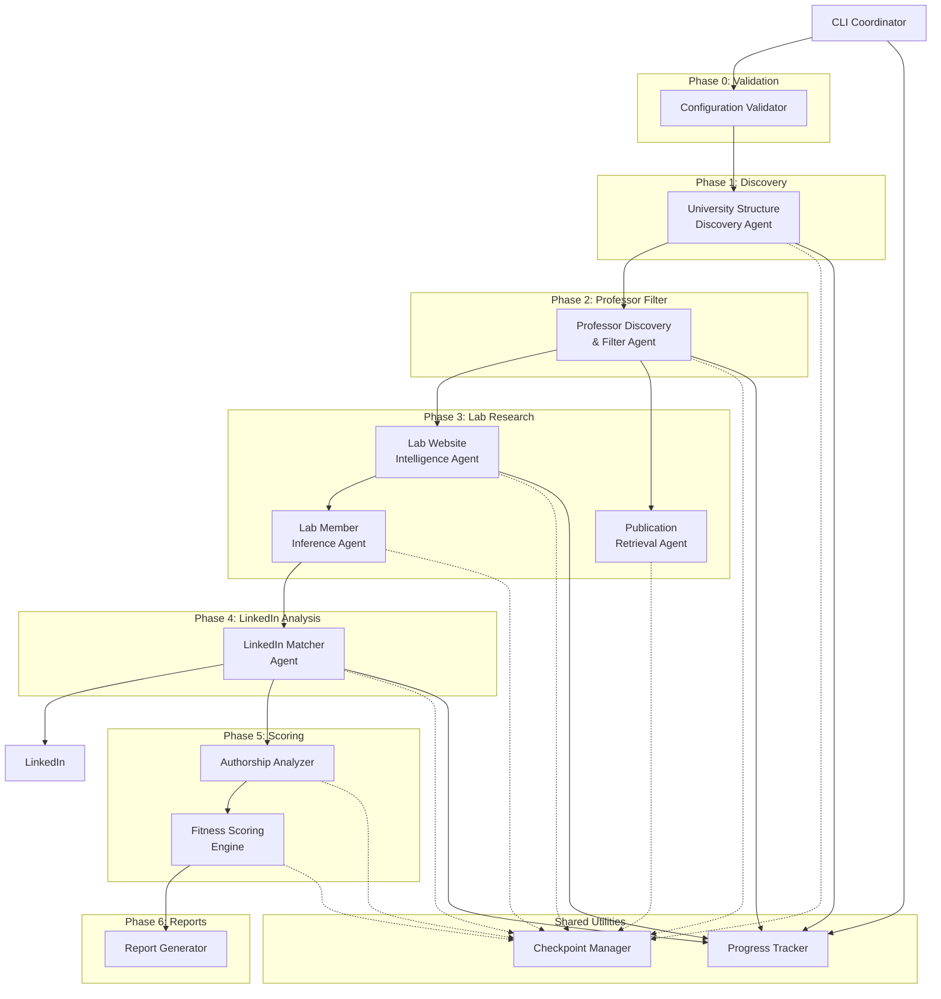

# Components

**IMPORTANT:** Claude Agent SDK does NOT have `AgentDefinition` or sub-agent spawning. All components use the SDK's `query()` function with appropriate prompts.

This section defines the major logical components/services and their responsibilities. Each component is a Python module that uses Claude Agent SDK's `query()` function. Parallel execution is achieved using Python's `asyncio.gather()`, NOT SDK-provided mechanisms.

## CLI Coordinator

**Responsibility:** Top-level orchestration of all pipeline phases; user interaction; progress tracking; checkpoint/resume logic

**Key Interfaces:**
- `main(config_path: str) -> None` - Entry point accepting configuration file path
- `run_phase(phase_name: str, checkpoint_dir: str) -> PhaseResult` - Execute or resume a phase
- `load_checkpoint(phase_name: str) -> Optional[dict]` - Load phase checkpoint if exists
- `save_checkpoint(phase_name: str, data: dict) -> None` - Save phase completion checkpoint

**Dependencies:**
- All phase components (calls sequentially)
- Checkpoint Manager (file I/O)
- Progress Tracker (rich library for CLI output)

**Technology Stack:**
- Python asyncio for async phase orchestration
- rich for progress bars and formatted output
- structlog for correlation ID generation and logging

**Agent Pattern:** Single coordinator agent; does NOT spawn sub-agents (delegates to phase components)

---

## Configuration Validator

**Responsibility:** JSON schema validation of all configuration files; credential management; user profile consolidation (Epic 1)

**Key Interfaces:**
- `validate_config(config_files: list[str]) -> ValidationResult` - Validate all configs against schemas
- `load_or_prompt_credentials() -> Credentials` - Load stored credentials or prompt user (FR2-FR3)
- `consolidate_profile(configs: dict) -> UserProfile` - Merge configs into research profile (FR6)

**Dependencies:**
- jsonschema for JSON validation
- python-dotenv for credential loading
- pydantic for config parsing into models
- LLM (via Claude SDK) for resume summarization and research interest streamlining

**Technology Stack:**
- jsonschema 4.21.1 for validation
- pydantic 2.5.3 for config models
- Claude Agent SDK for LLM-based summarization

**Agent Pattern:** Python module using Claude Agent SDK query() function

- Validates JSON configs against schemas
- LLM-based resume summarization and research interest streamlining via SDK query()
- Synchronous execution (Phase 0 prerequisite for all other phases)
- Checkpoint saved to phase-0-validation.json
- See docs/architecture/agent-definitions.md for implementation patterns

---

## University Structure Discovery Agent

**Responsibility:** Discover department hierarchy; filter relevant departments (Epic 2: FR7-FR9)

**Key Interfaces:**
- `discover_structure(university_url: str) -> list[Department]` - Scrape and map department tree
- `filter_departments(departments: list[Department], profile: UserProfile) -> list[Department]` - LLM-based relevance filtering

**Dependencies:**
- Claude Agent SDK built-in web tools (primary)
- Playwright (fallback for JS-heavy pages)
- LLM for department relevance assessment
- Checkpoint Manager for saving department structure

**Technology Stack:**
- Claude Agent SDK web fetch tools
- Playwright 1.40.0 as fallback
- structlog with phase context

**Agent Pattern:** Python module using Claude Agent SDK query() function with application-level parallel processing

- Coordinator calls `discover_structure()` function to initiate university discovery
- Parallel processing of departments/schools implemented using asyncio.gather() with Semaphore (application-level)
- Returns filtered department structure with checkpoint saved to phase-1-departments.jsonl
- See Story 2.1 (refactored) and Story 3.1 v0.5 for parallel execution implementation patterns

---

## Professor Discovery & Filter Agent

**Responsibility:** Identify professors in relevant departments; LLM-based research field filtering (Epic 3: FR10-FR13)

**Key Interfaces:**
- `discover_professors(departments: list[Department]) -> list[Professor]` - Scrape professor directories
- `filter_professors_batch(professors: list[Professor], profile: UserProfile) -> list[Professor]` - Batch LLM filtering with confidence scores

**Dependencies:**
- Web scraping tools (built-in + Playwright)
- LLM for professor filtering and confidence scoring
- Checkpoint Manager for batch checkpoints

**Technology Stack:**
- Claude Agent SDK for web scraping and LLM filtering
- aiolimiter for rate limiting per university domain
- tenacity for retry logic on scraping failures

**Agent Pattern:** Python module using Claude Agent SDK query() function with parallel async processing

- Discovery: Scrapes professor directories in parallel per department using asyncio.gather()
- Filtering: LLM-based filtering with confidence scoring via SDK query()
- Sequential execution: discovery → filtering
- Batch checkpoints enable mid-phase resume
- See Story 3.1 v0.5 and docs/architecture/agent-definitions.md for implementation patterns

---

## Lab Website Intelligence Agent

**Responsibility:** Scrape lab websites; check Archive.org history; extract contact information (Epic 4: FR14, FR20)

**Key Interfaces:**
- `scrape_lab_website(lab_url: str) -> LabWebsiteData` - Extract website content, last update date
- `check_wayback_history(lab_url: str) -> list[str]` - Query Archive.org for snapshot dates
- `extract_contact_info(website_data: LabWebsiteData) -> ContactInfo` - Find emails, contact forms

**Dependencies:**
- Web scraping tools
- httpx for Archive.org API calls
- LLM for identifying contact information in unstructured HTML

**Technology Stack:**
- httpx 0.26.0 for Archive.org Availability API
- Claude Agent SDK for website scraping and contact extraction
- tenacity for retry logic

**Agent Pattern:** Python module using Claude Agent SDK query() function with parallel async batch scraping

- WebFetch primary via SDK query(), Playwright fallback for JS-heavy sites
- Parallel execution across labs using asyncio.gather() (configurable batch size)
- Archive.org API calls via httpx for snapshot history
- Checkpoints saved to phase-3-labs-batch-N.jsonl
- See Story 3.1 v0.5 for parallel execution patterns

---

## Publication Retrieval Agent

**Responsibility:** Retrieve publications via paper-search-mcp; analyze abstracts; assign journal scores (Epic 5: FR15-FR17, FR30)

**Key Interfaces:**
- `fetch_publications(author_name: str, affiliation: str, years: int) -> list[Publication]` - Query paper-search-mcp
- `analyze_abstract(publication: Publication, profile: UserProfile) -> float` - LLM relevance scoring
- `assign_journal_scores(publications: list[Publication]) -> None` - Lookup SJR scores from CSV

**Dependencies:**
- paper-search-mcp MCP server
- Scimago SJR CSV database (loaded once at startup)
- pandas for CSV processing
- LLM for abstract relevance analysis

**Technology Stack:**
- MCP client for paper-search-mcp
- pandas 2.1.4 for SJR CSV loading
- Claude Agent SDK for abstract analysis

**Agent Pattern:** Python module using Claude Agent SDK query() function with MCP integration for parallel retrieval

- Queries paper-search-mcp MCP server per professor via SDK
- MCP tool: `mcp__papers__search_papers` with author + affiliation query
- LLM analyzes abstracts for relevance scoring via SDK query()
- SJR journal scores loaded from CSV at startup
- Parallel execution across professors using asyncio.gather()
- See Story 5.1 and docs/architecture/agent-definitions.md for implementation patterns

---

## Lab Member Inference Agent

**Responsibility:** Infer lab members from co-authorship patterns when websites unavailable (Epic 5: FR31)

**Key Interfaces:**
- `infer_members_from_coauthorship(pi_publications: list[Publication]) -> list[LabMember]` - Analyze frequent co-authors
- `validate_member_affiliation(member_name: str, university: str) -> bool` - LLM checks institutional match

**Dependencies:**
- Publication data from previous phase
- LLM for co-author pattern analysis and affiliation validation

**Technology Stack:**
- Claude Agent SDK for pattern analysis
- python-dateutil for timeline analysis

**Agent Pattern:** Python module using Claude Agent SDK query() function for co-authorship pattern analysis

- Analyzes frequent co-authors from publication data
- LLM validates university affiliation for inferred members via SDK query()
- Sequential processing (lightweight, no parallelization needed)
- Marks inferred members with is_inferred=true and confidence score
- Flags in data_quality: "members_inferred_from_coauthorship"
- See docs/architecture/agent-definitions.md for implementation patterns

---

## LinkedIn Matcher Agent

**Responsibility:** Match lab members to LinkedIn profiles; detect graduating PhDs (Epic 6: FR21-FR22)

**Key Interfaces:**
- `match_profile(member: LabMember, university: str) -> LinkedInMatch` - Search LinkedIn via MCP and LLM-match profiles
- `detect_graduating_phds(members: list[LabMember], graduation_duration: float) -> list[LabMember]` - Calculate expected graduation

**Dependencies:**
- mcp-linkedin MCP server (profile search and data retrieval)
- LLM for profile matching with confidence scoring
- python-dateutil for graduation timeline calculations

**Technology Stack:**
- mcp-linkedin MCP server (adhikasp-mcp-linkedin)
- Claude Agent SDK for LLM-based matching
- python-dateutil 2.8.2 for date calculations

**Agent Pattern:** Python module using Claude Agent SDK query() function with parallel MCP-based LinkedIn matching

- Uses mcp-linkedin MCP server for profile search/retrieval via SDK
- MCP tools: `mcp__linkedin__search_people`, `mcp__linkedin__get_profile`
- LLM matches profiles considering name variants and affiliations via SDK query()
- MCP server handles authentication and rate limiting (no application queue needed)
- Parallel execution using asyncio.gather() for processing multiple lab members concurrently
- Calculates expected graduation dates from LinkedIn education data
- See Story 6.1 and docs/architecture/agent-definitions.md for implementation patterns

---

## Authorship Analyzer

**Responsibility:** Analyze publication authorship patterns; identify collaborations (Epic 7: FR23-FR24, FR18)

**Key Interfaces:**
- `analyze_authorship(lab: Lab, publications: list[Publication]) -> AuthorshipAnalysis` - Calculate author position metrics
- `assess_collaboration_role(analysis: AuthorshipAnalysis) -> str` - LLM determines core vs. collaborator
- `identify_collaborations(publications: list[Publication]) -> list[Collaboration]` - Extract external collaborators

**Dependencies:**
- Publication data from checkpoints
- LLM for core vs. collaborator assessment considering field norms

**Technology Stack:**
- Claude Agent SDK for collaboration assessment
- Pure Python for author position calculations

**Agent Pattern:** Python module using Claude Agent SDK query() function for authorship pattern analysis

- Calculates PI author position distribution
- LLM assesses core vs. collaborator role based on field norms via SDK query()
- Identifies external collaborators from co-author affiliations
- Sequential processing (in-memory analysis, no heavy I/O)
- Checkpoint saved to phase-5-authorship.jsonl
- See docs/architecture/agent-definitions.md for implementation patterns

---

## Fitness Scoring Engine

**Responsibility:** LLM-driven multi-factor scoring of labs (Epic 7: FR25)

**Key Interfaces:**
- `identify_scoring_criteria(profile: UserProfile) -> dict[str, float]` - LLM dynamically selects criteria and weights
- `score_lab(lab: Lab, criteria: dict) -> FitnessScore` - Calculate scores per criterion
- `rank_labs(scores: list[FitnessScore]) -> list[FitnessScore]` - Sort by overall score

**Dependencies:**
- All lab data from checkpoints (website, publications, members, authorship)
- LLM for criteria identification and scoring

**Technology Stack:**
- Claude Agent SDK for LLM-driven scoring
- Pure Python for score normalization and ranking

**Agent Pattern:** Python module using Claude Agent SDK query() function for LLM-driven fitness scoring

- LLM identifies scoring criteria dynamically based on user profile via SDK query()
- Scores each lab across multiple criteria with weighted calculation
- Parallel batch scoring using asyncio.gather() (configurable batch size, e.g., 10 labs per batch)
- Provides rationale and priority recommendations (1=top, 2=strong, 3=consider)
- Checkpoint saved to phase-5-scores.jsonl with ranked results
- See docs/architecture/agent-definitions.md for implementation patterns

---

## Report Generator

**Responsibility:** Generate Overview.md with comparison matrix and detailed lab reports (Epic 8: FR26-FR29)

**Key Interfaces:**
- `generate_overview(ranked_labs: list[FitnessScore]) -> str` - Create Overview.md with rankings
- `generate_comparison_matrix(top_labs: list[Lab], n: int) -> str` - Markdown table for top N labs
- `generate_lab_report(lab: Lab, score: FitnessScore) -> str` - Detailed individual lab report
- `flag_data_quality_issues(lab: Lab) -> list[str]` - Collect all quality flags

**Dependencies:**
- All checkpoint data (labs, scores, publications, members)
- rich for markdown rendering preview (optional)

**Technology Stack:**
- Pure Python for markdown generation
- jinja2 (add to tech stack if needed) or f-strings for templating
- rich 13.7.0 for markdown preview

**Agent Pattern:** Python module for markdown report generation

- Loads all checkpoint data and generates reports
- Creates Overview.md with ranked labs and comparison matrix
- Generates individual lab reports with data quality flags (⚠️ markers)
- Single-threaded execution (fast I/O operations, no parallelization needed)
- All reports saved to output/ directory
- See docs/architecture/agent-definitions.md for implementation patterns

---

## Checkpoint Manager

**Responsibility:** Save and load JSONL checkpoints; manage batch-level resumability

**Key Interfaces:**
- `save_batch(phase: str, batch_id: int, data: list[BaseModel]) -> None` - Write batch to JSONL
- `load_batches(phase: str) -> list[dict]` - Load all completed batches for phase
- `get_resume_point(phase: str) -> int` - Identify first incomplete batch
- `mark_phase_complete(phase: str) -> None` - Write phase completion marker

**Dependencies:**
- jsonlines library for JSONL I/O
- pydantic for model serialization

**Technology Stack:**
- jsonlines 4.0.0 for streaming read/write
- pydantic models with `.dict()` serialization

**Agent Pattern:** Utility module (not an agent); called by all components

---

## Progress Tracker

**Responsibility:** User-facing progress indicators; ETA calculations

**Key Interfaces:**
- `start_phase(phase_name: str, total_items: int) -> None` - Initialize progress bar
- `update(completed: int) -> None` - Increment progress
- `complete_phase() -> None` - Finalize progress display

**Dependencies:**
- rich library for formatted CLI output

**Technology Stack:**
- rich 13.7.0 Progress and Console APIs

**Agent Pattern:** Utility module (not an agent); called by coordinator

---

## Component Diagram

---

**Component Design Decisions:**

**1. Clear Phase Boundaries:**
- Each phase component produces complete output before next phase begins
- Enables batch-level checkpointing and resume
- Simplifies testing (mock previous phase outputs)

**2. Centralized Checkpoint Management:**
- Single Checkpoint Manager component rather than per-component logic
- Consistent JSONL format across all phases
- Easier to implement resume logic

**3. MCP Server Integration:**
- mcp-linkedin server handles LinkedIn authentication and rate limiting
- No application-level queue needed (simplifies architecture significantly)
- Parallel LinkedIn profile matching enabled

**4. LLM Integration Points:**
- Validation: Resume summarization, research interest streamlining
- Discovery: Department relevance, professor field matching
- Analysis: Abstract relevance, profile matching, authorship assessment
- Scoring: Criteria identification, lab scoring

**5. Web Scraping Isolation:**
- University Discovery, Professor Discovery, and Lab Intelligence are separate components
- Each implements built-in tools + Playwright fallback independently
- Failures in one component don't cascade to others
