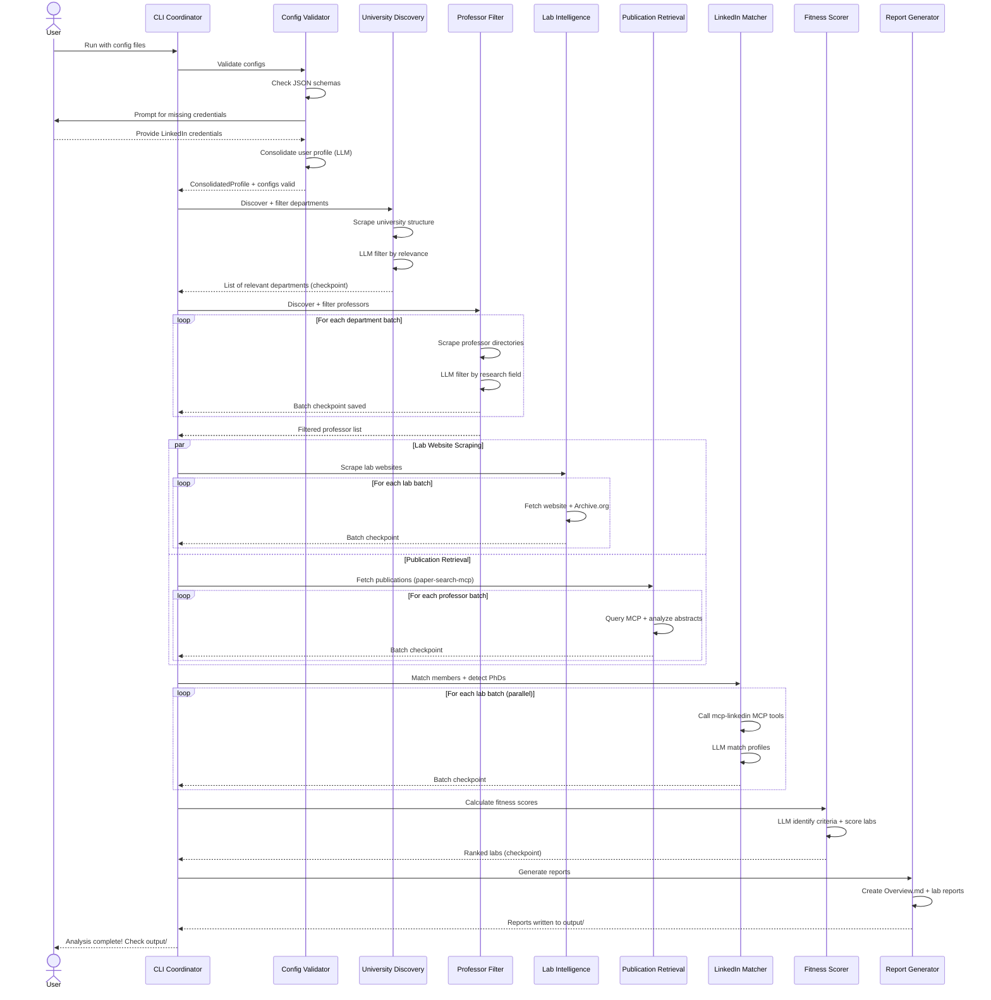
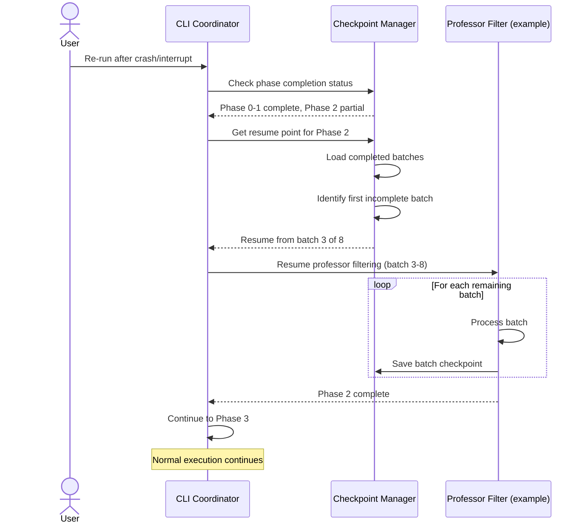
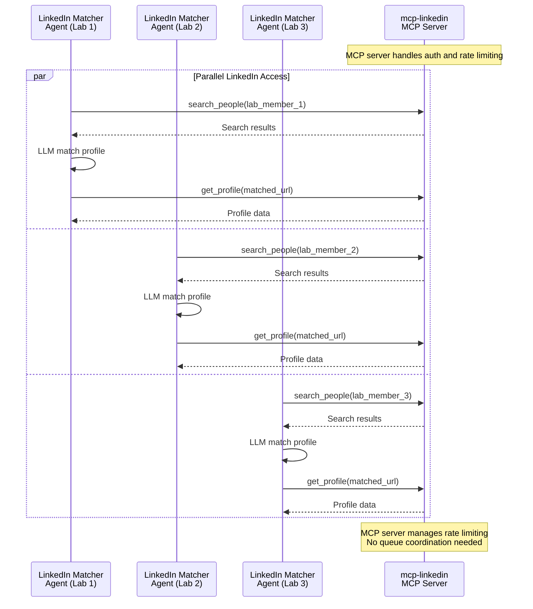
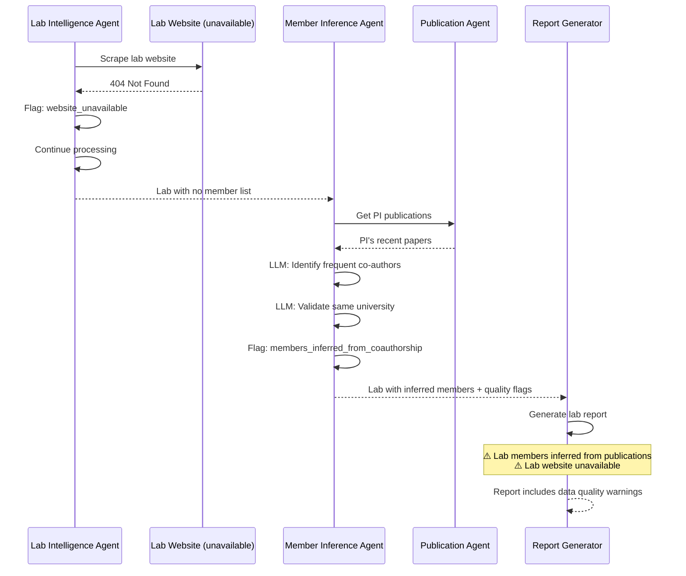

# Core Workflows

## Workflow 1: End-to-End Lab Discovery Pipeline

---

## Workflow 2: Checkpoint Resume After Failure

---

## Workflow 3: Parallel LinkedIn MCP Access Pattern

---

## Workflow 4: Graceful Degradation for Missing Data

