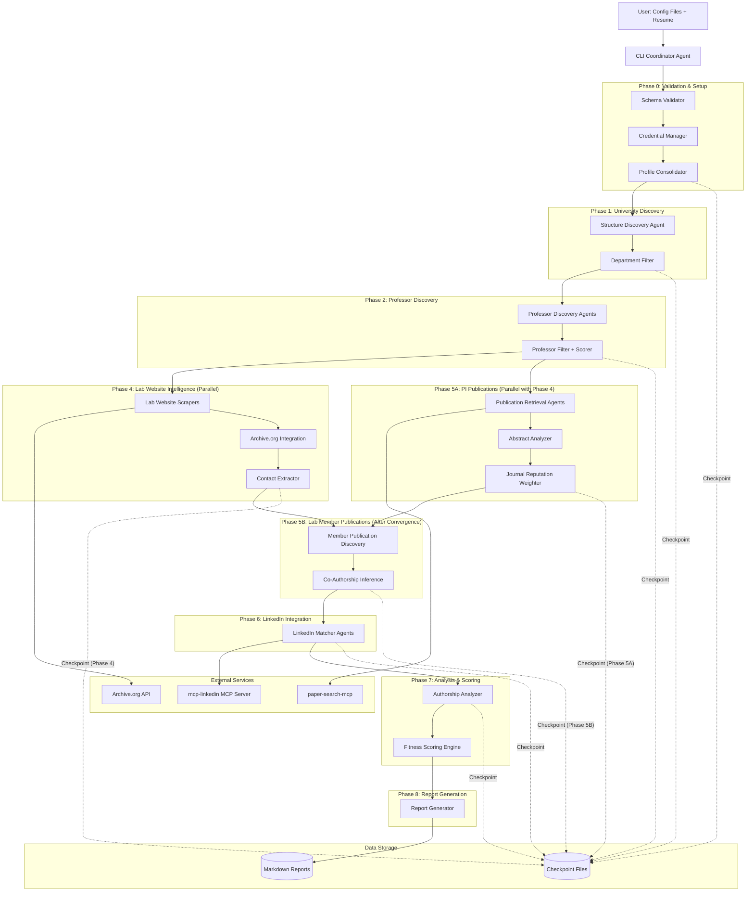

# High Level Architecture

## Technical Summary

Lab Finder is a **monolithic multi-agent Python application** orchestrated by the Claude Agent SDK. The system follows a **phased pipeline architecture** with checkpoint-based resumability, where each phase produces intermediate artifacts for the next.

The architecture centers on **hierarchical agent delegation**: a coordinator agent manages five sequential phases, delegating specialized sub-agents for parallel data collection (department discovery, professor analysis, publication retrieval, LinkedIn matching). Resource contention is managed through **queue-based coordination** for shared resources like the LinkedIn browser session.

Core technology choices include Python 3.11+ for async/await patterns, Playwright for browser automation, and MCP servers (paper-search-mcp) for publication data. The system emphasizes **graceful degradation** - missing data is flagged but doesn't block pipeline progression.

This architecture directly supports the PRD goals of systematic lab discovery with comprehensive intelligence gathering while managing complexity through phase isolation and configurable batch processing.

## High Level Overview

**Architectural Style:** Phased Pipeline with Multi-Agent Orchestration

**1. Main Architecture Pattern:**
- **Monolithic Application** (not microservices) - single Python process with multi-agent orchestration
- **Phased Pipeline** - 7 distinct phases (6 sequential + 1 parallel) with checkpoint-based resumability
- **Agent Delegation Model** - coordinator agent spawns specialized sub-agents per phase
- **Parallel Execution Optimization** - Phase 4 (Lab Websites) and Phase 5A (PI Publications) execute concurrently for 15-20% timeline reduction

**2. Repository Structure:**
- **Monorepo** (confirmed in PRD Technical Assumptions)
- Single Python project with clear module boundaries per phase

**3. Service Architecture:**
- **Single-process multi-agent system** (per PRD: "Monolithic Application with Multi-Agent Orchestration")
- Sub-agents execute in parallel within batch limits
- Shared resources (LinkedIn session) accessed via queue

**4. Primary Interaction Flow:**
```
User → CLI Input (config files) → Validation Phase →
University Discovery → Professor Filtering →
    ├─→ Lab Websites (Phase 4) ──┐
    └─→ PI Publications (Phase 5A) ─┘→ Convergence →
Lab Member Publications (Phase 5B) → LinkedIn Matching →
Authorship Analysis → Fitness Scoring → Report Generation →
Markdown Reports Output
```

**Note:** Phase 4 and Phase 5A execute in parallel to reduce overall timeline by 15-20%.

**5. Key Architectural Decisions:**

| Decision | Rationale |
|----------|-----------|
| **Phased pipeline vs. reactive event-driven** | Sequential phases with checkpointing enable resumability; clear progression tracking |
| **File-based persistence vs. database** | One-off execution doesn't justify database overhead; JSONL checkpoints sufficient |
| **Batch parallelism vs. unlimited concurrency** | Rate limiting compliance; prevents resource exhaustion; respects web scraping ethics |
| **Single shared Playwright session** | Minimizes LinkedIn ban risk; reduces authentication overhead |
| **Built-in web tools with Playwright fallback** | Leverages Claude Agent SDK capabilities; Playwright handles authentication edge cases |

## High Level Project Diagram



## Architectural and Design Patterns

**1. Multi-Agent Orchestration Pattern: Hierarchical Coordinator with Batch Delegation**

✅ **VALIDATED by Claude Agent SDK AgentDefinition**

**SDK Implementation:**
- Use `AgentDefinition` to create specialized agents per phase
- SDK handles parallel subagent execution automatically
- Coordinator manages phase progression via `ClaudeAgentOptions`
- Agents have isolated contexts (checkpoint-based state passing required)

**Options Considered:**
- **Option A:** Flat agent pool with work queue (all agents equal, pull tasks from queue)
- **Option B:** Hierarchical coordinator with phase-specific sub-agents (coordinator spawns specialized agents per phase)
- **Option C:** Event-driven reactive agents (agents respond to events, no central coordination)

**Recommendation:** **Option B - Hierarchical Coordinator**

**Rationale:**
- ✅ Direct SDK support via AgentDefinition
- ✅ Parallel execution built into SDK
- ✅ Clear phase progression tracking (user can see "Phase 2 of 6 complete")
- ✅ Checkpoint isolation aligns with agent context isolation
- ✅ Simplifies error handling (phase-level retry vs. per-agent recovery)
- ✅ Supports the PRD's explicit phased structure (Epics 1-8 map to phases)

---

**2. Data Persistence Pattern: Checkpoint/Restore with Batch-Level Granularity**

**Recommendation:** File-based JSONL checkpoints per batch within each phase

**Rationale:**
- Satisfies NFR12 (persist intermediate results for resumability)
- No database overhead for one-off execution tool (NFR9)
- JSONL format ideal for large lists (professors, publications) - append-only, stream-processable
- Batch-level checkpoints enable mid-phase restart: `checkpoints/phase-N-batch-M.jsonl`
- Resume logic: "Load completed batches, resume from first incomplete batch"
- Example: If 5 of 8 professor batches complete, restart from batch 6

---

**3. Concurrency Pattern: Bounded Parallel Batches with Hybrid Phase Execution**

**Recommendation:** Most phases execute sequentially; **Phase 4 and Phase 5A execute in parallel**; within each phase, sub-agents process in configurable batches

**Parallel Execution Model:**
- **Phase 4** (Lab Websites) and **Phase 5A** (PI Publications) run concurrently
- Both start after Phase 3 (Professor Filtering) completes
- **Convergence point** before Phase 5B: Both Phase 4 and 5A must complete
- Timeline reduction: **15-20%** compared to sequential execution

**Rationale:**
- Prevents overwhelming rate limits (NFR11, NFR4)
- Configurable batch sizes per phase (e.g., 5 departments, 20 professors, 10 labs)
- Playwright instance limits (NFR4: "limit concurrent Playwright instances")
- Clear progress indicators: "Processing batch 3 of 8 (professors 21-40)"

---

**4. Parallel Phase Convergence Pattern: Checkpoint-Based Validation**

**Recommendation:** Coordinator validates both Phase 4 and Phase 5A completion before starting Phase 5B

**Convergence Validation Logic:**
```python
async def validate_parallel_phase_completion(self):
    """Validate Epic 4 & 5A both complete before Epic 5B"""
    phase4_complete = self.checkpoint_mgr.phase_complete("phase-4-labs")
    phase5a_complete = self.checkpoint_mgr.phase_complete("phase-5a-pi-publications")

    if not phase4_complete:
        raise IncompletePhaseError("Phase 4 (Lab Websites) not complete")
    if not phase5a_complete:
        raise IncompletePhaseError("Phase 5A (PI Publications) not complete")

    logger.info("Convergence validated: Phase 4 & 5A complete, proceeding to Phase 5B")
    return True
```

**Progress Tracking During Parallel Execution:**
```python
# Display format during parallel phases
"Phase 4: Lab Websites [X/Y labs] | Phase 5A: PI Publications [A/B professors]"

# Display after convergence
"Convergence validated: Phase 4 & 5A complete → Starting Phase 5B (Member Publications)"
```

**Checkpoint Requirements:**
- Phase 4 checkpoint: `checkpoints/phase-4-labs-batch-*.jsonl`
- Phase 5A checkpoint: `checkpoints/phase-5a-pi-publications-batch-*.jsonl`
- Both must exist and be complete before Phase 5B can start

**Rationale:**
- Ensures data dependencies met (Phase 5B needs both lab member lists AND PI publications)
- Prevents premature Phase 5B execution if one parallel phase fails
- Clear user feedback about convergence point
- Enables resume from convergence if Phase 5B interrupted
- Story 5.4 and 5.5 explicitly depend on this convergence validation

---

**5. MCP-Based LinkedIn Access Pattern: Parallel MCP Server Integration**

**Recommendation:** Use mcp-linkedin MCP server for all LinkedIn operations; no queue needed

**Rationale:**
- MCP server handles authentication and session management internally
- Rate limiting managed by MCP server (no application-level queue required)
- Enables parallel LinkedIn profile matching (multiple agents can call MCP concurrently)
- Eliminates Playwright session complexity and ban risk management
- Simpler architecture: agents call MCP tools directly without coordination

---

**5. Error Handling Pattern: Graceful Degradation with Data Quality Flags**

**Recommendation:** Continue pipeline on failures; flag missing data in reports

**Rationale:**
- NFR13: "graceful degradation and clear error reporting"
- FR31-FR32: Infer missing data where possible; flag inferences
- Philosophy: Partial results better than no results
- Example: Missing lab website → infer members from co-authorship → flag as "inferred"

---

**6. Web Scraping Strategy: Tiered Fallback (Built-in → Playwright → Skip with Flag)**

**Recommendation:** Try Claude Agent SDK built-in tools first, fallback to Playwright, skip if both fail

**Rationale:**
- NFR5: "built-in web tools as primary, Playwright as fallback"
- Built-in tools faster and simpler for public pages
- Playwright needed for authenticated pages (LinkedIn) and JS-heavy sites
- Skip with data quality flag if both fail (don't crash pipeline)

---

**Decisions Finalized:**
- ✅ **Checkpoint format:** JSONL for efficient batch processing and streaming
- ✅ **Phase restart granularity:** Batch-level restart within phases
- ✅ **Batch sizes:** Default to 5 departments, 20 professors, 10 labs (configurable in system parameters)
- ✅ **LinkedIn Access:** Use mcp-linkedin MCP server (no Playwright queue needed)
